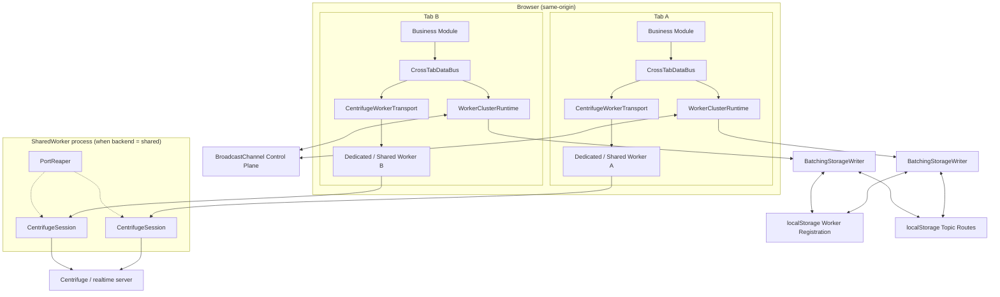
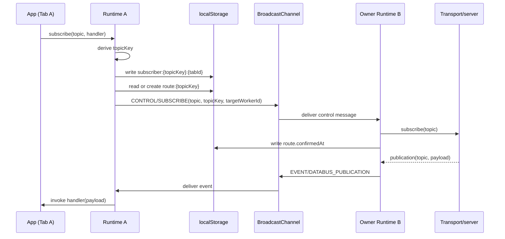
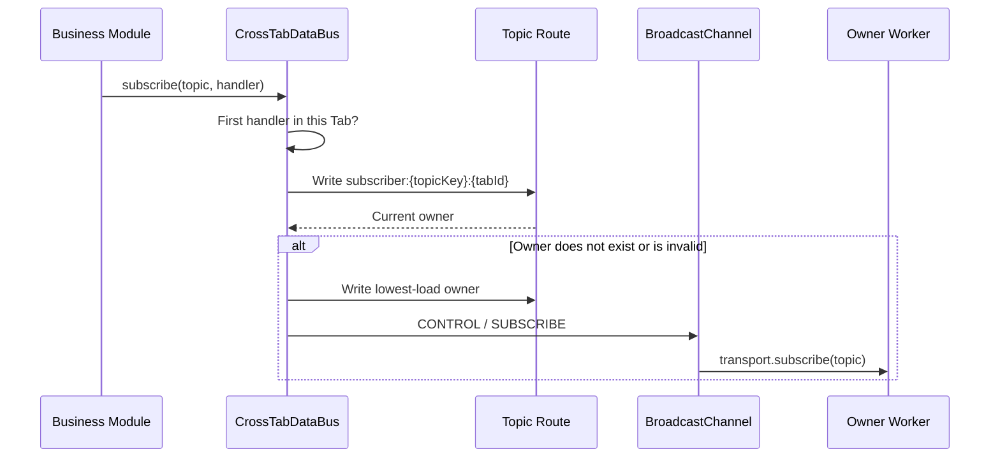
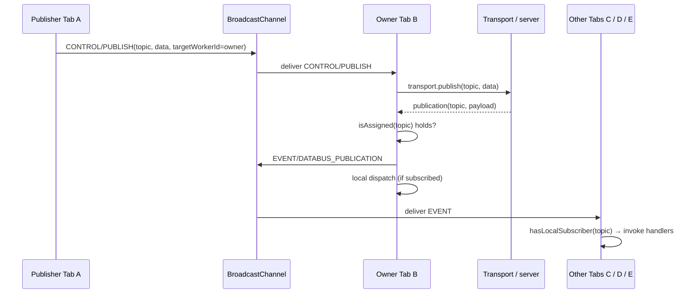

> [中文](./zh/architecture.md) | English

# Architecture

## Runtime Model



By default, when `workerMode: 'dedicated'`, each Tab has its own dedicated transport Worker. When configured as `shared` or `auto` and the browser supports SharedWorker, same-origin tabs share the same SharedWorker; each connection port within the SharedWorker creates its own independent `CentrifugeSession`, so one Tab refreshing or stopping does not affect other Tabs. The `auto` mode degrades in order of **SharedWorker → Dedicated Worker → Local mode**, while the `dedicated` mode degrades in order of **Dedicated Worker → SharedWorker → Local mode**. `BroadcastChannel` is only responsible for control messages and real-time publication forwarding; localStorage is only responsible for eventually-consistent coordination metadata.

Because `MessagePort` has no `close` event, a tab that crashes before sending `STOP` would otherwise leak its session and WebSocket. The main thread therefore sends a `PING` every 10 seconds, and the SharedWorker reaps any port that stays silent for more than 30 seconds, releasing the session and its subscriptions.

## Layers

| Layer | Entry | Responsibility |
|---|---|---|
| DataBus | `CrossTabDataBus` | Local handler reference counting, message dispatch, state and transport lifecycle |
| Replay | `ReplayManager` | Bounded per-topic history ring, durable IndexedDB persistence, retention cleanup, retry policy |
| Dedup  | `DedupManager`  | Opt-in bounded duplicate suppression by `messageId`, adaptive TTL, expiry sweep |
| Cluster Coordination | `WorkerClusterRuntime` | Worker registration, roles, heartbeat, Topic owner, migration and broadcast protocol |
| Transport | `DataBusTransport` | Executes subscribe, unsubscribe, publish on the real Worker/connection |
| Centrifuge | `CentrifugeWorkerTransport` | Protocol adaptation between the main thread and the built-in Centrifuge Worker |

## Source Layout & Shared Utils

The `src/` tree keeps platform adapters and the coordination core beside a small
`src/utils/` toolbox:

| File | Contents | Consumers |
|---|---|---|
| `utils/constants.ts` | Every runtime string literal in one place — statuses, roles, actions, cluster/worker/protocol message types, trace event discriminants, enums, namespace prefixes. All literal-derived types (`WorkerStatus`, message `type` fields, trace `action`/`operation`, …) are derived from these constants with `(typeof X)[keyof typeof X]`, so a value and its type cannot drift apart. | all modules |
| `utils/metadata.ts` | `publicationMetadata(messageId, timestamp)` — spreads only defined metadata, previously duplicated across four modules. | data-bus, cluster, centrifuge, centrifuge-session |
| `utils/storage-utils.ts` | `readJson` / `writeJson` / `listKeys` / `readAllByPrefix` — fault-tolerant storage primitives (corrupt JSON → absent; failed write → swallowed). | cluster |
| `utils/validation.ts` | Constructor/option validation asserts (`assertReplayOptions`, `assertDedupOptions`, `assertRecoveryOptions`, `assertHeartbeatInterval`, …). Optional fields are validated only when explicitly provided; defaults are always valid. | data-bus, replay-persistence, centrifuge |
| `utils/error-utils.ts` | `serializeError` / `deserializeWorkerError` + `SerializedWorkerError` — Error round-tripping across the Worker boundary. | centrifuge, centrifuge-session |

Extracting these was deliberate: they are side-effect-free, dependency-light
helpers whose duplicated copies had already started to drift (e.g. four
near-identical `publicationMetadata` implementations). Stateful cross-cutting
concerns with their own lifecycle — replay buffering and dedup — live as
self-contained `DedupManager` / `ReplayManager` classes that the DataBus
delegates to; they own their maps/timers/stats and expose thin start/stop/
record/clear surfaces. The DataBus lifecycle state machine (start/stop/
suspend/resume, promise gates, recovery pacing) was kept inside
`CrossTabDataBus` on purpose: those flags interlock tightly and extracting
them would re-introduce the race conditions the gates exist to prevent.

## Glossary

Terms are explained in plain language; the code and the rest of this document use the short names.

| Term | Short name in code | Plain-language meaning |
|---|---|---|
| **Topic** | `topic` | A named channel (e.g. `price.feed`) that applications subscribe to or publish on. |
| **Topic key** | `topicKey` | An opaque 128-bit hash of the Topic name. The Topic name itself is never persisted in coordination storage. |
| **Tab** | `tabId` | One browser page instance. `tabId` survives refresh so a tab keeps its identity across the page lifecycle. |
| **Worker** | `workerId` | One runtime instance inside a Tab. Each Worker publishes its own heartbeat and can own Topics. A Tab can briefly run two Workers during a restart/handoff. |
| **Topic owner** | — | The Worker responsible for the real transport subscription of a Topic. "Owner" is a hat a Worker wears, not a permanent role: it receives the Topic's publications from the server and fans them out to other Tabs. |
| **Assignment** | `assignedTopics` | The set of Topics a Worker currently owns. |
| **Active / standby** | `role` | `active` Workers are eligible to become new Topic owners; `standby` Workers are not. A hidden tab is still `active` if it already owns Topics. |
| **Subscriber** | `subscriber` | A Tab that holds a local subscription record for a Topic. |
| **Route** | `route` | The persisted record mapping a `topicKey` to its owner Worker. |
| **Sticky** | — | Existing routes keep their owner while that owner is alive; load and visibility only affect placement of brand-new routes. |
| **Heartbeat** | `heartbeatAt` | A Worker's periodic liveness write to storage. Workers past `workerTtlMs` without refreshing are considered dead. |
| **Handoff** | `handoffFromWorkerId` | The graceful passing of a Topic from an old owner to a new one (e.g. on `pagehide`), with a strict release-ACK protocol so no Topic is ever owned twice simultaneously. |
| **Generation** | `generation` | A monotonic counter on each route. Handoff ACKs must reference the route's exact generation, so delayed ACKs from any other handoff round are ignored. |
| **Local mode** | `coordinated: false` | Degraded operation when storage or BroadcastChannel is unavailable: no cross-Tab routing, the Tab only uses its own transport. |

## Storage Structure

All keys are isolated by `createOpaqueKey(clusterKey)`. Topics are also stored as 128-bit opaque keys.

BroadcastChannel messages carry topic names, event types, and publication payloads in plaintext. Only the channel name (derived from `clusterKey`) is hashed. If topic names are sensitive, avoid including them as part of the plaintext payload, or use an end-to-end encryption layer on top of the data bus.

```text
cross-tab-worker-databus:{clusterHash}:worker:{workerId}
cross-tab-worker-databus:{clusterHash}:route:{topicKey}
cross-tab-worker-databus:{clusterHash}:subscriber:{topicKey}:{tabId}
```

Unlike the old single-JSON route table, subscribers use per-Tab independent keys. When Tab A and Tab B subscribe/unsubscribe concurrently, they do not perform a read-modify-write on the same `subscribers[]`, structurally reducing the probability of lost updates.

### Worker Record

```ts
interface WorkerRecord {
  workerId: string;
  tabId: string;
  load: number;
  role: 'active' | 'standby';
  status: 'connecting' | 'connected' | 'disconnected' | 'error';
  visibilityState: 'visible' | 'hidden';
  heartbeatAt: number;
  registeredAt: number;
}
```

Each Worker writes its own record independently. `load` is the number of Topics it is responsible for, not CPU percentage.

### Topic Route

```ts
interface WorkerRoute {
  topicKey: string;
  workerId: string;
  tabId: string;
  updatedAt: number;
  generation: number;
  handoffFromWorkerId?: string;
  confirmedAt?: number;
}
```

`generation` increments on every re-assignment and must match across the handoff handshake; `handoffFromWorkerId` records the previous owner during a graceful handoff. The interface above matches the current protocol — see [Failover](#failover) for how these two fields drive takeover.

Routes do not store the original topic string or payload. When the actual owner receives `CONTROL/SUBSCRIBE`, the original topic string is only passed through the BroadcastChannel in-memory message. The receiver accepts that control frame only when the durable route currently names it; a delayed frame from an earlier assignment round is dropped, and a route awaiting `ROUTE_RELEASED` can be confirmed only by the matching handoff ACK. `confirmedAt` is written after the owner processes the control message; before the route is confirmed, the subscriber Runtime holding the original topic string will resend `SUBSCRIBE` to recover from BroadcastChannel message loss that results in "a route without a real subscription".

### How `topic`, `topicKey`, `tabId`, `workerId`, and BroadcastChannel relate

These identifiers represent different layers:

| Object | Meaning | Main use | Persisted in coordination storage |
|---|---|---|---|
| `topic` | Original application Topic string | Passed to transport `subscribe`, `unsubscribe`, and `publish` | No; kept in Runtime memory and control messages |
| `topicKey` | Stable opaque key from `createOpaqueKey(topic)` | Joins route and subscriber records | Yes |
| `tabId` | Stable identity of a browser Tab | Identifies which Tab subscribes to a `topicKey` | Yes, in subscriber keys |
| `workerId` | Identity of the current Runtime/Worker instance | Identifies the Worker that owns the transport subscription | Yes, in worker/route records |
| `BroadcastChannel` | Same-origin, in-memory real-time channel | Carries control actions, publication events, and reconciliation signals | No |

```text
topic
  └─ createOpaqueKey(topic) → topicKey
       ├─ route:{topicKey}
       │    └─ workerId / tabId / generation / confirmedAt
       └─ subscriber:{topicKey}:{tabId}

BroadcastChannel CONTROL
  └─ topic + topicKey + sourceWorkerId + targetWorkerId + action
```

`topicKey` links storage records to control messages, but it cannot be reversed to recover the original `topic`. Only a live Runtime retains the in-memory `topicKey → topic` mapping.

### In-memory topic key cache (`knownTopics`)

Each Runtime maintains a `Map<topicKey, topic>` called `knownTopics` that serves as the reverse-lookup cache from opaque key to plaintext topic. It is populated by `rememberTopic()`, which is called on every `subscribe`, `publish`, `unsubscribe`, and inbound `CONTROL` message.

The cache exists for two reasons:

1. **Storage-less fallback.** When localStorage is unavailable (degraded mode), `readRoute()` and `readSubscriberTabIds()` have no persisted records to query. They reconstruct the route from in-memory state — but that requires recovering the plaintext `topic` from a `topicKey`. Without `knownTopics`, a topic whose key was evicted would silently return `null` from `readRoute()` even though the worker still owns it.

2. **Avoid re-hashing on every reconcile.** Each reconcile cycle iterates `subscribedTopics` and calls `rememberTopic` for each topic. The cache is updated unconditionally (hash is cheap, so there is no hit/miss penalty), but the reverse mapping is essential for the storage-less path.

**Cap and eviction.** The cache is capped at `MAX_KNOWN_TOPICS = 500` entries. This limit prevents a misbehaving or malicious peer from exhausting memory by referencing arbitrary topics in control messages — every `CONTROL` message the handler processes calls `rememberTopic`, which would otherwise grow the map unboundedly.

Eviction is FIFO (insertion order, Map iteration order). When the cache exceeds the cap, the oldest entry (first key in Map iteration) is removed:

- An entry is **never evicted** if the current worker still owns it (`assignedTopics.has(oldest)` guard), because the storage-less `readRoute` path depends on it.
- The entry being inserted is never evicted in the same step (`oldest !== topicKey` guard).
- Reads do not promote recency, so this is not true LRU. Hashing is cheap enough that a missed reverse-lookup merely recomputes the key.

**`isAssigned` bypasses the cache.** `isAssigned(topic)` calls `createOpaqueKey(topic)` directly rather than `rememberTopic()`. This is deliberate: `isAssigned` is a read-only query, not a state change, so it must not populate `knownTopics` (which could evict an entry the storage-less path needs). It also prefers the synchronous `assignedTopics` Map over reading the route from storage, avoiding a race with the `BatchingStorageWriter` flush window.

**Opaque key collision.** `createOpaqueKey` is a non-cryptographic 128-bit hash. The birthday collision bound (~2⁶⁴ for 50% probability) is far beyond the number of topics a single cluster handles (thousands at most). Similarly, `clusterKey` is hashed via `createOpaqueKey` to derive the storage prefix and BroadcastChannel name. In practice, `clusterKey` is always a connection URL or a developer-controlled namespace — naturally unique, so cross-cluster collision is not a concern.

**`clusterKey` isolation.** The `clusterKey` defines the cluster boundary. Two DataBus instances with different `clusterKey` values — even in the same origin — operate on completely isolated storage namespaces and BroadcastChannel names, even if they happen to use the same transport connection. This is how different logical clusters (e.g. market data vs. notifications) coexist without cross-talk.

**`knownTopics` lifecycle.** The cache is populated, read, and cleaned at specific points:

| Event | `knownTopics` mutation | Why |
|---|---|---|
| `subscribe(topic)` | `rememberTopic(topic)` → `set(topicKey, topic)` | Populate the reverse mapping; needed for storage-less `readRoute` |
| `publish(topic, data)` | `rememberTopic(topic)` → `set(topicKey, topic)` | Populate; same reason |
| `unsubscribe(topic)` | `delete(topicKey)` if not in `assignedTopics` | No longer needed; only keep it if we still own the topic |
| `CONTROL` received (any action: SUBSCRIBE / UNSUBSCRIBE / PUBLISH) | `rememberTopic(message.topic)` → `set(topicKey, topic)` | Every inbound control message carries the plaintext topic and the handler caches it before acting |
| `CONTROL/UNSUBSCRIBE` received | no direct deletion | `rememberTopic` still caches the topic; the entry is later removed by `reconcileAssignedTopics` once the route no longer points to this worker |
| `reconcileAssignedTopics` | `delete(topicKey)` if not subscribed and not owned | Route no longer points to us — clean up unless we're still a subscriber |
| `stop()` | `clear()` | Full teardown |
| FIFO eviction (next `rememberTopic` call) | `delete(oldest)` if `!assignedTopics.has(oldest)` | Cache size exceeded `MAX_KNOWN_TOPICS`; never evict owned keys |

**Storage-less fallback dependency.** When `this.storage` is `null` (degraded mode), `readRoute()` and `readSubscriberTabIds()` cannot query persisted records. They reconstruct routes from in-memory state alone:

- `readRoute(topicKey)` → looks up `knownTopics.get(topicKey)` to recover the plaintext topic, then checks `subscribedTopics.has(topic)` or `assignedTopics.has(topicKey)` to determine if this worker is the owner.
- `readSubscriberTabIds(topicKey, workers)` → `knownTopics.get(topicKey)` recovers the plaintext topic, then checks `subscribedTopics.has(topic)` — if we are a subscriber, we are the only subscriber (no storage means no cross-tab coordination).

This is why `assignedTopics` guards the FIFO eviction: evicting a key we still own would silently break `readRoute()` in storage-less mode, causing `isAssigned()` to disagree with `readRoute()`.

### One subscription and publication flow



A second Tab subscribing to the same Topic adds only its own subscriber record; it does not create another transport subscription while the existing owner is alive. Unsubscribe removes the current Tab's subscriber record. The owner unsubscribes the transport and removes the route only when no subscriber remains.

### Console diagnostics

If the application exposes the DataBus instance as `window.__bus`, the live Runtime can be inspected with:

```js
__bus.getClusterSnapshot().subscribedTopics
__bus.getClusterSnapshot().assignedTopics
__bus.getClusterSnapshot().knownTopics
console.table(__bus.getClusterSnapshot().routes)
```

`routes` now includes the plaintext `topic` (injected from the in-memory `knownTopics` cache), so each entry shows both the opaque key and the original topic name. `knownTopics` exposes the full `topicKey → topic` mapping for debugging. BroadcastChannel has no history API; inspect live messages by enabling trace or temporarily logging the `postMessage` and receive paths.

### Why Multiple localStorage Keys

This decentralized structure is a trade-off for concurrency correctness, not for reducing event listeners:

| Approach | Write Conflict | Cleanup Granularity | Main Issue |
|---|---|---|---|
| Single large JSON for Worker/route/subscriber | High | Only whole read/write | Multiple Tabs doing read-modify-write concurrently can easily overwrite each other, losing subscribers |
| Independent key per entity | Low | Can clean up per Worker, per route, per Topic+Tab precisely | More keys, requires TTL-based garbage collection |

The SDK does not rely on `storage` events to drive coordination; control notifications use BroadcastChannel. Although Worker heartbeats update their own independent key, this does not trigger repeated business callbacks or message dispatch within the SDK. The core benefit of separate keys is that different Tabs write different records, avoiding overwrite contention on a shared large object.

Under normal conditions, the number of keys is approximately: `Number of Workers + Number of Topic routes + Number of Topic/Tab subscription relationships`. The Runtime cleans up timed-out Workers, orphaned subscribers without active Tabs, and orphaned routes that have exceeded the Worker TTL and no longer have subscribers. Other naming structures left over from older versions do not belong to the current SDK protocol and do not participate in current route resolution.

### Storage Write Coalescing

Coordination metadata writes first enter an in-memory pending table, where they are merged by key within the same task (heartbeats, route confirmations, and subscriber updates share one flush), then batch-flushed to localStorage via a microtask. When a flush encounters a quota or write failure, it retries with exponential backoff from `50ms → 1600ms`. The current Tab's transport is not interrupted by coordination write failures. `clear()` resets the backoff counter to avoid starting retries from a delayed initial value after frequent cleaning.

Reads always see the not-yet-flushed pending values within the same task; cross-tab visibility is guaranteed by the microtask flush and the synchronous flush on `pagehide` / `stop()`. During `pagehide`, the owner writes and flushes the transferred route and its worker removal before broadcasting `REGISTRY`. If the unload-time `CONTROL / SUBSCRIBE` message is lost, receiving tabs therefore reconcile against the final persisted topology instead of waiting for their next heartbeat.

## Key State Inventory

Every keyed piece of state in the system — the full picture of what the previous sections described piece by piece. Each row has its own lifecycle; that is **why they are separate** and must not be merged:

| State | Owner class | Key | Value | Lifecycle | Why it is separate |
|---|---|---|---|---|---|
| `topicHandlers` | `CrossTabDataBus` | Plaintext `topic` | `Set<handler>` | Added/removed by app `subscribe`/`unsubscribe`; entry deleted when its last handler leaves | Reference-counts application-level handlers; belongs to the business layer |
| `transportSubscribedTopics` | `CrossTabDataBus` | Plaintext `topic` | marker | Cleared on disconnect; replayed from `assignedTopics` on reconnect | Tracks what the live transport connection actually holds; dies with the connection |
| `subscribedTopics` | `WorkerClusterRuntime` | Plaintext `topic` | marker | Grows as the first local handler subscribes; shrinks when the last one leaves | The Tab's durable subscription intent, survives transport failures |
| `assignedTopics` | `WorkerClusterRuntime` | `topicKey` | Plaintext `topic` | Set on receiving `CONTROL/SUBSCRIBE`; cleared on `CONTROL/UNSUBSCRIBE` or handoff | The authoritative "what I own" set; drives `isAssigned` and load |
| `knownTopics` | `WorkerClusterRuntime` | `topicKey` | Plaintext `topic` | FIFO-capped at 500; never evicts owned keys | The reverse-lookup cache; also the only source of plaintext in storage-less mode |
| Storage `worker:` | persisted | `clusterHash:…:worker:{workerId}` | JSON `WorkerRecord` | Heartbeat refresh; pruned after `workerTtlMs` | Cross-tab liveness discovery |
| Storage `route:` | persisted | `clusterHash:…:route:{topicKey}` | JSON `WorkerRoute` | Created/stamped by subscriber; pruned when no subscribers + TTL expired | Cross-tab owner mapping |
| Storage `subscriber:` | persisted | `clusterHash:…:subscriber:{topicKey}:{tabId}` | JSON `TopicSubscriberRecord` | Written per Tab subscription; pruned when the Tab dies | Cross-tab subscriber intent |

**How the three in-memory topic forms relate** (`knownTopics` ↔ `assignedTopics` ↔ the four plaintext sets):

```text
app subscribe/unsubscribe loop
        │  (handler reference counting)
        ▼
   topicHandlers ──────────────► subscribedTopics ──► storage subscriber + route
        (plaintext topic)         (plaintext topic)      (topicKey)
                                            │ CONTROL/SUBSCRIBE on the wire
                                            ▼
                                    assignedTopics ──► transport subscription
                                      (topicKey)         (plaintext topic again)
                                            │
                                            └─► knownTopics: reverse cache used by
                                                readRoute/readSubscriberTabIds (esp. storage-less)
```

The two `topicKey → topic` maps (`assignedTopics`, `knownTopics`) deliberately hold **the same pairs with different lifecycles**: `assignedTopics` is authoritative and never evicts, `knownTopics` is a bounded cache to keep plaintext reachable when no storage is present. After a plaintext topic leaves `assignedTopics` and `knownTopics` (via `reconcileAssignedTopics` or eviction), the Runtime can still read routes by `topicKey` — it just can no longer reverse them to plaintext.

## BroadcastChannel Protocol

All real-time coordination flows through one BroadcastChannel per cluster, whose name is derived from `clusterKey`. Messages on it exist only in memory: they never touch localStorage and never pass through the transport server. Four message types are exchanged:

| Type | Direction | Purpose |
|---|---|---|
| `CONTROL` | point-to-point (A → B) | Ask the target Worker to `SUBSCRIBE`, `UNSUBSCRIBE`, or `PUBLISH` a topic. Carries `action`, `topic`, `topicKey`, `targetWorkerId`, and an optional `data` payload. A `SUBSCRIBE` is honored only when the durable route currently names the target and is not awaiting `ROUTE_RELEASED`. |
| `EVENT` | broadcast (owner → all Tabs) | Fan out a publication that the transport delivered to the owning Worker. Carries `eventType` and `payload`. |
| `REGISTRY` | broadcast | Nudge every Tab to reconcile immediately after a registry or route write, instead of waiting for the next heartbeat. |
| `ROUTE_RELEASED` | point-to-point (old owner → new owner) | Acknowledge a graceful handoff; only the new owner whose route `generation` matches may `SUBSCRIBE` (see Failover). |

The owning Worker filters every publication it receives with `isAssigned(topic)`, and every Tab filters inbound `EVENT` messages through its local subscriber records — each message is therefore dispatched exactly once. BroadcastChannel never echoes a message back to its sender, which is also why the owner does not double-dispatch its own broadcast.

## Owner Selection

1. Workers with status `connecting` / `connected` are prioritized for the candidate set.
2. If a visible Tab exists, visible Workers are preferred when choosing an owner for a new Topic; when all Tabs are hidden, hidden Workers remain eligible.
3. Sorted by `registeredAt, workerId`, up to 3 active Workers are selected as new-route candidates.
4. An existing route remains sticky as long as its owner Worker record is alive, regardless of load, visibility, or whether the owner remains in the new-route candidate set.
5. A second Tab subscribing to an existing Topic only writes its subscriber record. It does not modify the route or call its own transport `subscribe`.
6. Only a Topic without a route, or a route whose owner has departed or expired by heartbeat TTL, is assigned to the least-loaded candidate Worker.
7. A new route is considered unconfirmed until the owner writes `confirmedAt`; the subscriber will automatically resend the control message.

### Adaptive owner weighting (`loadWeighting`)

By default "least-loaded" means the fewest owned Topics. The opt-in `loadWeighting`
option adds traffic and scheduling signals, still only for NEW or orphaned routes —
existing routes stay sticky and are never migrated:

- Each Worker samples its own fan-out activity between heartbeats and publishes a
  `WorkerThroughputSample` (`windowMs`, `messageCount`, `byteCount`, `overrunMs`,
  `sampledAt`) with the worker record.
- `overrunMs` is the positive excess of the sample window over the nominal heartbeat
  interval. A starved event loop (the browser-observable proxy for CPU saturation)
  lands heartbeats late and stretches the window, so this is a cheap native signal.
- `effectiveWorkerLoad` (a pure function in `routing.ts`) scores a Worker as
  `load + messageRateWeight × msg/s + byteRateWeight × B/s + scheduleLagWeight × (overrunMs ÷ windowMs)`.
  All weights default to `0`, keeping the legacy pure topic-count score byte-identical.
- The scorer is deterministic and reads the same persisted records on every tab, so
  routing agrees cluster-wide; a scheduling-laggy Worker becomes less attractive for
  new routes even when it carries fewer topics.

### Async credential refresh bridge (`credentialProvider`)

Centrifuge client options are structured-cloned into the Worker, so function-valued
`getToken` / `getChannelToken` cannot travel with the config. The opt-in
`credentialProvider` (`{ getToken, getChannelToken }`) on `createCentrifugeDataBus`
runs on the main thread instead:

1. When a provider is configured, INIT carries `tokenBridge: true` and the Worker's
   `CentrifugeSession` wires `getToken` / `getChannelToken` to issue a
   `TOKEN_REQUEST` output (`requestId`, `kind`, optional `channel`).
2. The transport resolves it on the main thread: `resolveTokenRequest` calls the
   provider and posts `TOKEN_RESPONSE` (or `TOKEN_ERROR` on rejection / empty token)
   back with the matching `requestId`.
3. The session settles the pending promise by `requestId`; a `STOP` rejects all
   in-flight requests so a stopped worker never awaits a response forever.
4. Without a provider, INIT omits `tokenBridge` and the config stays byte-identical
   to legacy — a server that never asks for a token triggers no requests.
5. Dedicated, SharedWorker, and local backends share `CentrifugeSession`, so the
   bridge works across all three; the token never crosses the Worker boundary as a
   function, only as a resolved string.

## Subscription Flow



Within the same DataBus instance, multiple handlers subscribing to the same topic are only registered once; the Tab's subscription is only canceled from the cluster after the last handler is released.

### Subscription state layers

The system maintains four independent subscription-tracking sets. Understanding their relationship is key to the architecture:

| Set | Location | Tracks | Lifecycle |
|---|---|---|---|
| `topicHandlers` | `CrossTabDataBus` | Application-level handler references per topic | Added/removed by `subscribe(topic, handler)` / `unsubscribe(topic, handler)` |
| `subscribedTopics` | `WorkerClusterRuntime` | Topics this tab has asked the cluster to coordinate | Added when `topicHandlers` goes 0→1; removed when it goes n→0 |
| `assignedTopics` | `WorkerClusterRuntime` | Topics this worker is the owner of (transport subscription responsibility) | Set on receiving `CONTROL/SUBSCRIBE`; cleared on `CONTROL/UNSUBSCRIBE` or handoff |
| `transportSubscribedTopics` | `CrossTabDataBus` | Topics the transport has been asked to subscribe to | Cleared on disconnect; replayed from `assignedTopics` on reconnect |

**Subscription propagation chain:**

```text
Application: subscribe(topic, handler)
  → topicHandlers 0→1
    → cluster.subscribe(topic) → subscribedTopics.add(topic)
      → write subscriber:{topicKey}:{tabId}
      → readRoute(topicKey)
        → if no route: selectLeastLoadedWorker, writeRoute, sendControl(SUBSCRIBE)
          → owner receives CONTROL/SUBSCRIBE
            → assignedTopics.set(topicKey, topic)
            → transport.subscribe(topic) → transportSubscribedTopics.add(topic)
```

**Unsubscribe propagation chain:**

```text
Application: unsubscribe(topic, handler) (last handler)
  → topicHandlers empty
    → cluster.unsubscribe(topic) → subscribedTopics.delete(topic)
      → releaseSubscription → delete subscriber record
        → if no subscribers left: delete route, sendControl(UNSUBSCRIBE)
          → owner receives CONTROL/UNSUBSCRIBE
            → assignedTopics.delete(topicKey)
            → transport.unsubscribe(topic) → transportSubscribedTopics.delete(topic)
```

**Disconnect / reconnect behavior:**

- On transport disconnect: `transportSubscribedTopics` is **cleared** immediately. The other three sets (`topicHandlers`, `subscribedTopics`, `assignedTopics`) survive unchanged.
- On transport reconnect: `CrossTabDataBus` iterates `assignedTopics` and re-calls `transport.subscribe(topic)` for each one, repopulating `transportSubscribedTopics`.
- This is how business subscription intent survives transport failures: the application never needs to re-subscribe after a reconnect.

## Message Flow

A publication travels publisher → current Topic owner → transport/server → owner → all Tabs:

1. Any Tab calls `publish(topic, data)`. The Runtime looks up `route:{topicKey}` and sends `CONTROL/PUBLISH` to the owner Worker; when no route exists the message is submitted to the current Tab's own transport.
2. The owner runs `transport.publish(topic, data)`. Because only the owner holds a real transport subscription to the topic, the server delivers the resulting publication back to exactly one Worker.
3. The owner accepts a publication only while `isAssigned(topic)` still holds. Stale messages from an expired owner are discarded — keeping the fan-out single-sourced.
4. The owner broadcasts `EVENT/DATABUS_PUBLICATION` over the BroadcastChannel and, if its own Tab also has a local subscription, dispatches once directly. BroadcastChannel never echoes to the sender, so there is no duplicate dispatch.
5. Every other Tab receives the `EVENT` but invokes its local handlers only when it holds a `subscriber:{topicKey}:{tabId}` record for that topic; Tabs without a local subscription drop the message.

Optional publication metadata (`messageId` and `timestamp`) follows the same path as the payload: `CONTROL/PUBLISH` → transport/server → `DataBusMessage` → `EVENT` fan-out. It is never written to coordination storage. Transports normalize legacy payloads and the canonical `DataBusPublicationEnvelope` before the three dispatch gates.

At the `EVENT` boundary, frames carrying an unknown `eventType` or a publication payload without a string `topic` are ignored. Legacy publication payloads without `originTabId` inherit the frame-level value, while an explicit payload-level `originTabId` wins. These rules keep the channel forward-compatible with older/newer SDK peers and prevent one malformed frame from breaking later delivery.

At the transport layer, a Centrifuge client can emit a publication both on the `client` object and on the matching `Subscription` object. To avoid dispatching the same server publication twice, the Centrifuge session only handles the client-level `publication` for topics that have **no active client-side subscription** (server-side subscriptions); topics with an active subscription are delivered solely through the subscription-level listener.



BroadcastChannel does not echo to its sender, so the owner receives no `EVENT` back for its own broadcast — its local dispatch is the only local delivery.

Publications are not written to localStorage. Message data and publication metadata only exist in the BroadcastChannel in-memory event and within the transport; batch writes only cover coordination metadata.

### Service Worker boundary

The SDK intentionally does not host a real-time transport in a Service Worker. Service Workers can be terminated between events, do not provide a durable foreground connection lifetime, and impose browser-specific restrictions around long-lived WebSockets. A future adapter would need an explicit connection owner, client wake-up protocol, reconnection policy, and durable handoff semantics; until those are standardized and covered by browser tests, Dedicated/Shared Worker transports remain the supported runtime models.

### Dispatch flow: three gates

After the optional `messageId` deduplication gate, every accepted publication from the transport goes through three checks before reaching the application handler:

1. **`isAssigned(topic)`** — called on the owning Worker when a transport message arrives (`handleTransportMessage`). If the topic is no longer assigned to this worker (e.g. a stale message from a previous ownership window), the message is dropped immediately. This is the outer gate: it prevents a non-owner from broadcasting.

2. **`broadcastEvent('DATABUS_PUBLICATION', message)`** — called only after `isAssigned` passes. The owning Worker fans the message out to all tabs via BroadcastChannel `EVENT`. Each tab receives the event but does not dispatch yet — it must pass the inner gate.

3. **`hasLocalSubscriber(topic)`** — called on each tab receiving the `EVENT`. Only tabs that have a local subscriber record for this topic invoke the registered handler. Tabs without a local subscription drop the message silently.

These three checks provide **at-most-once fan-out per accepted transport publication**:
- The outer gate (`isAssigned`) prevents duplicate broadcasts from a stale owner.
- The inner gate (`hasLocalSubscriber`) prevents a tab from dispatching a topic it never subscribed to.
- BroadcastChannel never echoes to its sender, so the owner does not receive its own `EVENT` — its local dispatch is the only local delivery.

This is a local fan-out guarantee, not an end-to-end delivery guarantee. A transport or server can redeliver a publication, a disconnected or suspended tab can miss the `EVENT`, and BroadcastChannel fan-out has no application-level acknowledgment. Opt-in `dedup` can suppress repeated `messageId` values within its bounded per-bus window, but it is best-effort, per-instance, and reset by `stop()`. The SDK therefore does not provide end-to-end at-least-once or exactly-once delivery; applications that cannot tolerate duplicates or gaps must use idempotent handlers and the transport/server guarantees appropriate for their workload.

```text
Transport message → isAssigned(topic)? → Yes → broadcastEvent(EVENT)
                                                 ↓
                                     Each tab receives EVENT
                                                 ↓
                                     hasLocalSubscriber(topic)? → Yes → dispatch(handler)
```

## Coordination & Reconciliation

Cluster convergence is driven on two timelines:

- **Heartbeat + reconcile loop** (default `3000 ms`, `heartbeatIntervalMs`). On every tick each Worker refreshes its own record and runs a reconcile pass: prunes Workers past `workerTtlMs`, orphaned subscribers whose Tab is no longer active, and orphaned routes that have no subscribers and exceed the TTL; recomputes its own active/standby role; re-writes its subscriber records; and re-sends `CONTROL/SUBSCRIBE` for any route that still lacks `confirmedAt` — which also recovers control messages lost on the channel.
- **`REGISTRY` nudge**. Writes to Worker records, routes, or subscribers broadcast a `REGISTRY` message so every peer reconciles immediately rather than waiting for the next heartbeat.

Heartbeat writes are not announced, so a stale record is only noticed within one heartbeat interval. The worst case for failing to detect a dead owner is `heartbeatIntervalMs + workerTtlMs` (default about 13 s); see [TTL Message-Loss Window](./configuration.md#ttl-message-loss-window) for the trade-offs.

## Failover

On normal close or entry into BFCache, `pagehide` pauses the Runtime: it deletes Worker and subscriber records, yields the actual owner, and closes the underlying transport, but retains the business subscription intent in memory. After the page is restored via `pageshow`, DataBus rebuilds the Worker/connection, and the Runtime automatically re-registers, restores subscriber records, and reconciles Topics, without requiring the business to re-call `subscribe`.

#### Tab identity and `window.open`

Each Runtime stores its `tabId` in `sessionStorage` so refreshes retain identity; every Runtime gets a random-suffixed `workerId`. Browsers may clone the opener's `sessionStorage` when `window.open()` creates a page, causing two physical tabs to share a `tabId` and collide on subscriber or diagnostic keys.

Applications should use `noopener` when opening a new tab. As a safety net, the SDK discards a copied sessionStorage id when an opener is detected and generates a fresh one. Inspection records are keyed by `tabId + workerId`, preventing Worker restart or handoff snapshots from overwriting one another.

`visibilitychange` does not remove business subscriptions or migrate established routes. A hidden Tab keeps the Topics it already owns and can still receive data broadcast by other owners. Visibility only affects candidate selection when a new Topic needs its first owner.

When an abnormal exit cannot execute the `pagehide` cleanup, other Runtimes scan Worker records and clean up by TTL.

If a Tab still subscribed to a Topic finds that the owner Worker has departed or expired, it selects a new owner and increments the route `generation`. Normal `pagehide` handoff is strict: the new route records `handoffFromWorkerId`, the old owner unsubscribes from transport first, then sends `ROUTE_RELEASED(generation)`, and only the matching new owner ACK handler sends `SUBSCRIBE`. If the old Worker has already disappeared, the new owner takes over immediately. A refreshed Tab that rejoins afterward records itself as a subscriber and reuses the replacement owner instead of taking the route back.

This process prevents overlap during graceful owner handoff while retaining availability during failure recovery; it does not turn the local fan-out guarantee into end-to-end at-least-once or exactly-once delivery.

## Stability Invariants

These invariants are pinned by regression tests (see `tests/stability.test.ts` and `tests/replay-persistence.test.ts`) and must hold through future refactors:

- **SUBSCRIBE route binding.** An inbound `CONTROL/SUBSCRIBE` is accepted only when the durable route currently names the receiver and is not an unconfirmed graceful handoff. A delayed frame from an earlier assignment round cannot add ownership, subscribe the transport, or confirm the route; only the matching `ROUTE_RELEASED` can authorize a pending handoff. Ownership follows the current route record, not the order in which control frames arrive.
- **Handoff ACK validity.** A `ROUTE_RELEASED` is accepted only when the route still points at the receiver, the release comes from the recorded `handoffFromWorkerId`, and the ACK generation exactly matches the stored route generation. Replayed ACKs from any other handoff round (e.g. an a↔b ping-pong) are dropped instead of confirming the current route.
- **Replay persistence cleanup ordering.** A batched persistence flush queued behind the current task is filtered against the cleanup that wins the race: `unsubscribe` and `clearReplayTopic` drop the topic's pending entries, `clearReplayBefore` drops entries older than the cutoff, and `suspend()`/`stop()` discard the whole queued batch before it can start under the next lifecycle generation. Cleared or stopped-session history is never re-appended by an in-flight flush.
- **Storage write recovery.** Coalesced writes retry with exponential backoff (50 ms → 1.6 s cap). A structurally failing key is dropped after 5 attempts (with a `console.warn`) without permanently blocking other queued keys, and the backoff delay resets once the queue fully drains or `clear()` cancels the retries.
- **Transport recovery budget.** Automatic recovery is paced by a cooldown, bounded by `recovery.maxAttempts`, and reports `exhausted` when the budget is spent. A successful reopen resets the attempt counter and the exhausted flag; explicit `subscribe` on a down transport can still recover manually. Scheduling alone does not reopen a connection: the backend must release the invalid connection before a retry can create or re-open one. `WebSocketTransport` resolves `start()` only after the socket opens, rejects a pre-open `error`/`close` or a `connectTimeoutMs` expiry, marks the socket active only until error/close, and drops the stale reference before the next `start()` invokes the factory, so late callbacks from the superseded socket are ignored.
- **BFCache suspension.** Hiding the tab stops the transport, bumps the persistence-retry generation (cancelling in-flight persistence retries without surfacing errors), pauses trace metrics and periodic dedup/replay cleanup, and gates dispatch; `pageshow` or an explicit `start()` reopens the transport, resumes those periodic resources, and re-establishes subscriptions exactly once per cycle.
- **Recovery waiter invalidation.** Each operation parked behind the recovery gate captures the recovery cancellation generation. `stop()` and `suspendTransport()` invalidate that generation when they supersede the recovery cycle, so a waiter whose microtask runs after an immediate explicit `start()` cannot replay into the replacement transport. The restarted cluster owns exactly one resubscription per assigned topic, and the stale operation cannot issue a duplicate subscription.
- **Hidden-document activation guard.** `WorkerClusterRuntime.start()` installs lifecycle listeners before it checks visibility. A start that reaches a hidden document records suspension without registering a worker, opening a channel, or starting heartbeats, so a restart queued behind an asynchronous stop cannot miss a `pagehide` during cleanup and reconnect in the background; the installed listener handles the later `pageshow`.
- **Handoff channel close ordering.** `pause()` defers the physical `channel.close()` by one task. Closing synchronously would discard messages still queued for delivery — including the handoff's `ROUTE_RELEASED` — stranding the handoff target with an unconfirmed route.
- **Stranded-handoff recovery.** If the previous owner is gone and its `ROUTE_RELEASED` never arrives (dropped channel message under load, or a crash between the route write and the ACK), the reconcile loop re-elects a live owner once the unconfirmed handoff has been stuck longer than a worker TTL (10 s default): the route is rewritten with a fresh generation and the handoff marker cleared, so the normal confirmation path completes (pinned by regression). The age gate matters — a fresh unconfirmed route may simply be waiting out its confirmation flush — and while the previous owner is still alive the new owner keeps waiting, so the strict handoff keeps its no-overlap guarantee.
- **Loss and recovery matrix.** Each coordination message has a bounded recovery path: a lost `CONTROL/SUBSCRIBE` is re-sent by the heartbeat reconcile for any route still lacking `confirmedAt`; a lost `REGISTRY` nudge costs at most one heartbeat interval (3 s default) because every tick reconciles anyway; a lost `ROUTE_RELEASED` is recovered by reconcile re-election once the previous owner is gone and the handoff has been stuck longer than a worker TTL (see the stranded-handoff invariant above, pinned by regression); publications dropped during a transport disconnect window are the one documented unrecoverable loss (transport contract). The storage-event fallback channel guarantees value-change delivery via a monotonic sequence in the envelope, and a dropped dispatch recovers through the same reconcile loop.
- **Recovery diagnostics.** `getHealthSummary()` derives a single readiness verdict from the lifecycle flags (`stopped` / `starting` / `healthy` / `recovering` / `suspended` / `degraded`); the unified `lastFailure` ledger and persistence counters reset on every explicit `start()`.

## Transport Reconnection

DataBus separates "business subscription intent" from "transport current subscription state". When the transport reports `disconnected` / `error`, it only clears the underlying subscription flag, not the business handler; when it re-enters `connected`, DataBus automatically replays the Topics the current Worker is responsible for.

The built-in Centrifuge transport also retains its own Subscriptions and performs protocol-level reconnection. Both layers of recovery require `subscribe` / `unsubscribe` to be idempotent.

A runtime `error` intentionally keeps `transportReady` true: the flag records that the installed transport opened for this session, so `ready()` keeps tracking the transport instead of flapping with the protocol connection. Transport *operations* are gated separately by the recovery gate. While an automatic or demand-driven reopen is pending, `runTransport()` parks new `subscribe` / `publish` calls behind that gate rather than writing them to the connection that just reported `error`; the gate is released only once a reopen succeeds (or the transport self-heals to `connected`), and every parked operation then runs against the live transport. A failed automatic attempt keeps the gate closed but lets the next explicit operation drive an immediate on-demand reopen instead of waiting out another cooldown; an exhausted recovery budget releases the gate so parked operations can follow the documented explicit-retry path. A `stop()` / page-hide instead invalidates the parked recovery generation before releasing the gate, so an immediate `start()` re-establishes subscriptions on the replacement transport without a stale waiter replaying its operation afterward. `disconnected` is a clean close rather than a recoverable failure: it never schedules a background DataBus reopen, and only an explicit `start()`, a page restore, the transport's own reconnection, or a later transport operation returns it to `connected`. That last path matters because the ready fast path is refused once the transport has actually reached `connected` and then reports `disconnected`; a `subscribe()` / `publish()` arriving after such a clean close is parked behind the same recovery gate and drives exactly one on-demand reopen, then flushes against the replacement connection instead of being written to the closed one. A transport that resolved `start()` before its first `connected` (worker-style backends report the connection asynchronously) is still handed operations directly, because its `disconnected` status means "not connected yet" rather than "a working connection was lost".

## Lifecycle State Machine

`CrossTabDataBus` uses several boolean flags and promise gates to serialize lifecycle transitions. The interaction between them is the most complex part of the DataBus layer.

### Flags

| Flag | Type | Meaning |
|---|---|---|
| `started` | `boolean` | `start()` has been called and no `stop()` has completed since |
| `stopping` | `boolean` | `stop()` is in progress; prevents new operations |
| `suspended` | `boolean` | Tab is hidden; transport is intentionally stopped |
| `transportReady` | `boolean` | Transport opened successfully for the current session; retained through a runtime `error` so `ready()` keeps tracking the installed transport (pending operations are held by the recovery gate, not by this flag) |
| `startPromise` | `Promise \| null` | Gate for concurrent `start()` calls; cleared after settle |
| `stopPromise` | `Promise \| null` | Shared gate for an explicit `stop()` and any restart queued behind it; reused only while `stopping` is true, because the field is cleared one microtask after `performStop()` settles |
| `queuedStart` | `Promise \| null` | One fresh start waiting for an in-flight explicit stop to settle |
| `queuedStartToken` | `number` | Monotonic token issued to each queued restart so a cancellation cannot be mistaken for a later one |
| `canceledQueuedStartToken` | `number` | Highest queued-restart token invalidated by `stop()`; a continuation at or below it resolves without opening |
| `pendingStop` | `Promise \| null` | Gate for async `transport.stop()`; shared by suspend and failure paths |
| `lifecycleEpoch` | `number` | Monotonic ownership token; invalidates callbacks and cleanup from superseded opens |

### State transitions

```text
                  ┌──────────────────────────────────────────────┐
                  │                                              ▼
              ┌───────┐   start(config)    ┌──────────┐   openTransport ok   ┌───────────┐
              │ idle  │ ──────────────────→ │ starting │ ──────────────────→ │  running  │
              └───────┘                     └──────────┘                     └───────────┘
                  ▲                              │                               │
                  │                              │ openTransport fails           │ pagehide
                  │                              ▼                               │
                  │                          ┌──────────┐                        ▼
                  │                          │  failed  │                  ┌───────────┐
                  │                          └──────────┘                  │ suspended │
                  │                              │                         └───────────┘
                  │                              │ start(config) again          │
                  │                              ▼                              │ pageshow
                  │                          ┌──────────┐                        │
                  │                          │ starting │◄───────────────────────┘
                  │                          └──────────┘
                  │
                  │   stop()                  ┌──────────┐
                  └────────────────────────── │ stopped  │
                                              └──────────┘
```

**Key behaviors:**

- **Concurrent start**: If `start()` is called while a real transport opening is in flight, the second call returns the same promise. Only one transport open is in flight at a time. A page-hide stop can also occupy `startPromise`; `start()` recognizes that `startPromise === pendingStop` and queues a reopen behind the stop rather than returning the cleanup promise as if it were a successful start.
- **Failure notification ordering**: A transport can report `error` synchronously while its `start()` is still in flight. `openTransport()` updates the internal status immediately, but defers the user-facing `onStatus('error')` notification until it has cleared `transportReady`, torn down an initial-start cluster, installed the failed transport's stop gate, recorded the failure, and cleared `startPromise`. The startup-failure `onError` notification follows that cleanup as well. A synchronous `start()` retry from either callback therefore opens a fresh attempt after the stop gate instead of sharing the rejected promise. The retry resets the failure ledger, and the superseded opening's rejection is consumed by its own lifecycle cleanup so it cannot be recorded again after the retry succeeds. Ordinary concurrent starts during a genuinely in-flight open still share one promise.
- **Start during explicit stop**: `stop()` publishes a shared `stopPromise` for concurrent callers. A `start()` received while it is settling stores one `queuedStart`; after the stop's `finally` clears the lifecycle state, the queued start performs a fresh lifecycle with the new config. Repeated calls during that window share both the stop and queued-start promises. The shared gate is reused only while `stopping` is true: `performStop()` flips `stopping` back to false inside its `finally`, but `stopPromise` is cleared one microtask later, so a `start()`/`stop()` issued in that gap must fall through to a fresh teardown instead of resolving against the already-settled gate and leaving the restarted bus running.
- **Stop cancels a queued restart**: The queued continuation is chained to the stop promise and cannot be un-scheduled, so a second `stop()` before it runs invalidates it instead. Each queued restart carries a monotonic token; `stop()` records the current token and releases the single queue slot, and the continuation resolves without opening a transport when its own token is no longer newer. The queued `start()` promise retains that resolve-on-cancellation contract, while a separate readiness view makes `ready()` reject for the canceled intent. Because a later `start()` issues a higher token, `stop → start → stop → start` still ends running while `stop → start → stop` ends stopped with no extra transport open.
- **Stop-time publication rejection**: Once `stop()` sets `stopping`, new `publish()` and non-empty `publishBatch()` calls cannot reach a transport. They surface an error through `onError` rather than letting `runTransport()` return silently; empty batches stay no-ops. A publication already queued behind an in-flight open is canceled by the stop (latest intent wins), while page-hide suspension keeps its documented drop-without-defer semantics.
- **Stop-time lifecycle-operation rejection**: The `stopping` gate also covers `subscribe()` and `ready()`. A late `subscribe()` is reported through `onError` and returns a no-op cleanup, preventing a handler from being erased by `topicHandlers.clear()` or leaking into a later restart without its handler. `ready()` rejects instead of resolving against the stopping transport. If `start()` has already queued a restart behind the stop, `ready()` returns that queued-start promise because it is the newest lifecycle intent.
- **Stop-time health verdict**: `getHealthSummary()` reports `state: 'stopped'` / `healthy: false` for the whole teardown, not only after `started` flips to false. The transport can keep reporting `connected` until its asynchronous `stop()` settles, so deriving health from the live status alone produced a snapshot that claimed the bus was usable while `publish()`, `subscribe()`, and `ready()` all already rejected. `started` still reflects the real lifecycle flag, and `transport` still reports the live status/`ready` values as diagnostics; a restart queued behind the stop reads as `starting` once the queued start owns the lifecycle.
- **Queued-restart failure retention**: A queued restart that fails during transport startup clears `started` but retains its actual error for later `ready()` calls. Without `initialConfig`, those calls reject with the startup failure instead of the generic configuration error, while an explicit `start(config)` remains a clean manual retry with a fresh failure ledger.
- **Suspend during start**: If `pagehide` fires while `openTransport` is in flight, `suspendTransport()` sets `suspended = true` and chains a `transport.stop()` after the in-flight start. The `openTransport` catch path detects `suspended` and abandons the open without treating it as a failure. Repeated hide/show rounds that interleave a queued resume opening with an older stop gate install a fresh serial stop gate and restore the `startPromise === pendingStop` invariant, so the next `pageshow` reopens instead of reusing a superseded opening and leaving the bus suspended forever.
- **Readiness during suspend**: A suspended bus sets `suspended = true` and reuses `startPromise`/`pendingStop` for the chained `transport.stop()`, so that promise proves cleanup completed rather than readiness. `ready()` checks `suspended` after the `stopping` gate and rejects with a suspended-state error instead of returning the stop gate. `pageshow`/`reopenTransport()` and an explicit `start()` clear the flag and install a real reopen promise, so `ready()` follows the newest lifecycle intent. Because `pagehide` pauses the *cluster* independently of the transport, an explicit `start()` that leaves suspension resumes the cluster too; without that, the bus would report a healthy transport while its channel listener, heartbeat, and route assignments stayed dormant until the next `pageshow`, and every incoming publication would be discarded by `isAssigned()` against the cleared assignment map. `getHealthSummary()` already reported `{ healthy: false, state: 'suspended' }`; rejection keeps that verdict consistent with `ready()`.
- **Superseded open invalidation**: Every fresh start, reopen, suspend, and stop advances `lifecycleEpoch`. An open captures its epoch, ignores stale status/message/error callbacks, and neither marks the transport ready nor performs failure cleanup after a newer transition owns the lifecycle. `stop()` therefore waits for pending opens/reopens and prevents a superseded open from becoming ready after the stop completes.
- **Recovery cooldown**: When the transport reports `error` while `started` is true and `stopping` is false, `updateStatus` schedules an automatic `reopenTransport()` after `RECOVERY_COOLDOWN_MS` (1000 ms). A second error within the cooldown window is suppressed to prevent a tight retry loop.
- **Transport recovery gate**: Scheduling a reopen also arms a recovery gate, so `subscribe` / `publish` issued during the cooldown cannot reach the failed connection; they are released after the reopen succeeds. The gate deliberately survives a failed automatic attempt: the next explicit operation starts an immediate on-demand reopen instead of waiting for the next paced attempt, and parked operations flush behind that success. Exhausting `recovery.maxAttempts` releases the gate so the explicit-retry path remains reachable. Superseding the wait with `stop()` / `suspendTransport()` also invalidates every parked waiter before releasing the gate, so the explicit restart and its cluster resubscription cannot be followed by a duplicate stale operation. A runtime `error` does not clear `transportReady`, because clearing it would let caller traffic reopen the transport outside the cooldown and report readiness against a connection that is not carrying data.
- **Stop during suspend**: `stop()` sets `stopping = true`, which prevents `suspendTransport()` from running. The cleanup awaits `startPromise` and `pendingStop` to ensure any in-flight open or stop completes before the final `transport.stop()`.

## Degradation

The Runtime degrades to local mode when any of the following conditions are met:

- localStorage is not writable
- BroadcastChannel does not exist or construction fails
- SSR / Node environment without browser APIs

Local mode still calls the current transport's subscribe and publish methods, but does not perform cross-Tab routing or forwarding.

The Centrifuge transport also has a backend degradation scheme based on `workerMode`: `auto` tries SharedWorker → Dedicated Worker → main-thread local session in order; `dedicated` tries Dedicated Worker → SharedWorker → main-thread local session in order. The Runtime's cross-Tab degradation and the transport's backend degradation are independent of each other: even if the transport runs in a Worker, when localStorage or BroadcastChannel is unavailable, it still only runs within the current Tab.
