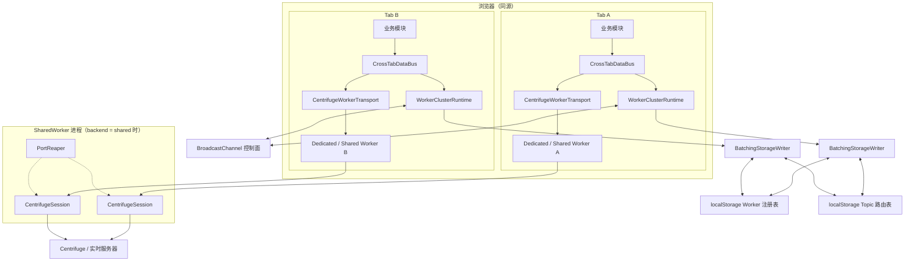
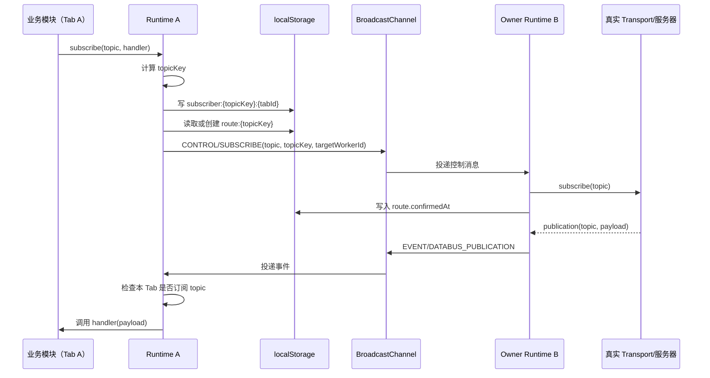
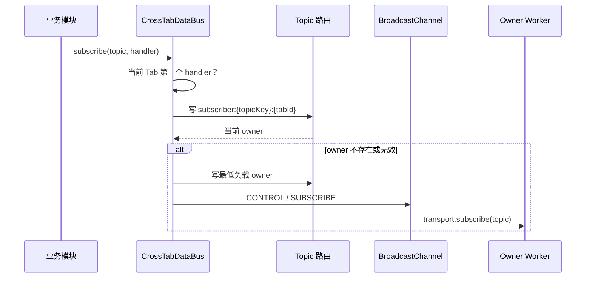
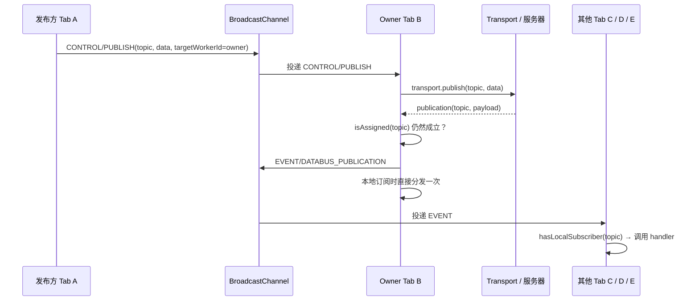

> 中文 | [English](../architecture.md)

# 架构说明

## 运行时模型



默认 `workerMode: 'dedicated'` 时，每个 Tab 使用独立的 transport Worker。配置为 `shared` 或 `auto` 且浏览器支持 SharedWorker 时，同源 Tab 复用同一个 SharedWorker；SharedWorker 内每个连接 port 各自维护独立的 `CentrifugeSession`，一个 Tab 刷新或停止不会影响其他 Tab。`auto` 模式按 **SharedWorker → Dedicated Worker → 主线程 WebSocket** 降级，`dedicated` 模式按 **Dedicated Worker → SharedWorker → 主线程 WebSocket** 降级。`BroadcastChannel` 只负责控制消息和实时 publication 转发；localStorage 只负责最终一致的协调元数据。

由于 `MessagePort` 没有 `close` 事件，Tab 崩溃且未发送 `STOP` 时会遗留 session 和 WebSocket。主线程因此每 10 秒发送一次 `PING`，SharedWorker 对超过 30 秒无消息的 port 执行回收，释放对应 session 及其订阅。

## 分层

| 层 | 入口 | 职责 |
|---|---|---|
| DataBus | `CrossTabDataBus` | 本地 handler 引用计数、消息分发、状态与 transport 生命周期 |
| Replay | `ReplayManager` | 有界的每 Topic 历史环形缓冲、IndexedDB 持久化、保留期清理、重试策略 |
| Dedup  | `DedupManager`  | 可选的按 `messageId` 有界去重、自适应 TTL、过期清扫 |
| 集群协调 | `WorkerClusterRuntime` | Worker 注册、角色、心跳、Topic owner、迁移和广播协议 |
| Transport | `DataBusTransport` | 在真实 Worker/连接上执行 subscribe、unsubscribe、publish |
| Centrifuge | `CentrifugeWorkerTransport` | 主线程与内置 Centrifuge Worker 之间的协议适配 |

## 源码组织与共享工具

`src/` 目录在平台适配器和协调核心之外维护一个轻量工具库 `src/utils/`：

| 文件 | 内容 | 使用方 |
|---|---|---|
| `utils/constants.ts` | 全部运行时字符串字面量集中一处——状态、角色、动作、集群/Worker/协议消息类型、trace 事件判别字段、枚举、命名空间前缀。所有由字面量派生的类型（`WorkerStatus`、消息 `type` 判别、trace 的 `action`/`operation` 等）都用 `(typeof X)[keyof typeof X]` 从这些常量派生，值和类型永不脱节。 | 所有模块 |
| `utils/metadata.ts` | `publicationMetadata(messageId, timestamp)`——只展开已定义字段，此前散落在四个模块各有一份。 | data-bus、cluster、centrifuge、centrifuge-session |
| `utils/storage-utils.ts` | `readJson` / `writeJson` / `listKeys` / `readAllByPrefix`——容错的存储原语（损坏 JSON 视为不存在；写失败静默）。 | cluster |
| `utils/validation.ts` | 构造参数/选项校验断言（`assertReplayOptions`、`assertDedupOptions`、`assertRecoveryOptions`、`assertHeartbeatInterval` 等）。可选字段只在显式提供时校验；默认值恒合法。 | data-bus、replay-persistence、centrifuge |
| `utils/error-utils.ts` | `serializeError` / `deserializeWorkerError` + `SerializedWorkerError`——Error 在 Worker 边界的往返传输。 | centrifuge、centrifuge-session |

提取是刻意的选择：这些是无副作用、依赖轻的助手，其重复副本已经开始漂移（例如四份几乎相同的 `publicationMetadata` 实现）。有自身生命周期的有状态横切关注点——回放缓冲与去重——则作为自包含的 `DedupManager` / `ReplayManager` 类，由 DataBus 委托调用；它们持有自己的 map/timer/统计并暴露薄的 start/stop/record/clear 接口。DataBus 生命周期状态机（start/stop/suspend/resume、promise 门、恢复节奏）则刻意保留在 `CrossTabDataBus` 内部：这些标志紧密互锁，拆出去会重新引入这些门原本要防的竞态。

## 术语表

用通俗语言解释核心术语；代码与本文档其余部分使用简称。

| 术语 | 代码中的简称 | 通俗含义 |
|---|---|---|
| **Topic**（主题） | `topic` | 一个有名字的频道（如 `price.feed`），应用订阅它或向它发布消息。 |
| **Topic key**（主题键） | `topicKey` | Topic 名称的 128-bit 不透明哈希。Topic 名称本身从不写入协调存储。 |
| **Tab**（标签页） | `tabId` | 一个浏览器页面实例。`tabId` 在刷新后保持稳定，让标签页在页面生命周期内保留身份。 |
| **Worker**（工作器） | `workerId` | Tab 内的一个运行时实例。每个 Worker 发布自己的心跳，也可以拥有 Topic。重启/交接时一个 Tab 可能短暂存在两个 Worker。 |
| **Topic owner**（主题持有者） | — | 负责某个 Topic 真实 transport 订阅的 Worker。"owner"是 Worker 戴的一顶帽子，不是永久角色：它从服务器接收该 Topic 的 publication 并扇出给其他 Tab。 |
| **Assignment**（归属） | `assignedTopics` | 当前 Worker 拥有的 Topic 集合。 |
| **Active / standby**（活跃/待命） | `role` | `active` Worker 有资格成为新 Topic 的 owner；`standby` 则没有。隐藏的 Tab 若已拥有 Topic，仍是 `active`。 |
| **Subscriber**（订阅者） | `subscriber` | 持有某个 Topic 本地订阅记录的 Tab。 |
| **Route**（路由） | `route` | 持久化的记录，把 `topicKey` 映射到它的 owner Worker。 |
| **Sticky**（粘性） | — | 已有 route 在 owner 存活期间保持归属；负载和可见性只影响全新 route 的放置。 |
| **Heartbeat**（心跳） | `heartbeatAt` | Worker 周期性写入存储的存活标记。超过 `workerTtlMs` 未刷新即视为死亡。 |
| **Handoff**（交接） | `handoffFromWorkerId` | 把 Topic 从旧 owner 移交给新 owner（如 `pagehide` 时）的流程，使用严格的释放-确认协议，保证同一 Topic 不会被两个 Worker 同时拥有。 |
| **Generation**（代次） | `generation` | 每条 route 上的单调递增计数器。交接确认必须精确引用当前 route 的代次，因此其他交接轮次的迟到确认会被忽略。 |
| **Local mode**（本地模式） | `coordinated: false` | storage 或 BroadcastChannel 不可用时的降级运行：无跨 Tab 路由，仅使用本 Tab 自己的 transport。 |

## 存储结构

所有 key 都通过 `createOpaqueKey(clusterKey)` 隔离。Topic 也以 128-bit 不透明 key 存储。

BroadcastChannel 消息以明文传输 Topic 名称、事件类型和 publication payload。只有通道名称（由 `clusterKey` 派生）会被哈希处理。如果 Topic 名称包含敏感信息，请避免将其包含在明文 payload 中，或在数据总线之上使用端到端加密层。

```text
cross-tab-worker-databus:{clusterHash}:worker:{workerId}
cross-tab-worker-databus:{clusterHash}:route:{topicKey}
cross-tab-worker-databus:{clusterHash}:subscriber:{topicKey}:{tabId}
```

与旧的单 JSON 路由表不同，subscriber 使用按 Tab 独立的 key。当 Tab A 和 Tab B 并发订阅/退订时，它们不会对同一个 `subscribers[]` 做读-改-写，从结构上降低丢失更新的概率。

### Worker 记录

```ts
interface WorkerRecord {
  workerId: string;
  tabId: string;
  load: number;
  role: 'active' | 'standby';
  status: 'connecting' | 'connected' | 'disconnected' | 'error';
  visibilityState: 'visible' | 'hidden';
  heartbeatAt: number;
  registeredAt: number;
}
```

每个 Worker 独立写入自己的记录。`load` 是它负责的 Topic 数量，不是 CPU 占比。

### Topic 路由

```ts
interface WorkerRoute {
  topicKey: string;
  workerId: string;
  tabId: string;
  updatedAt: number;
  generation: number;
  handoffFromWorkerId?: string;
  confirmedAt?: number;
}
```

`generation` 在每次重新分配时递增，交接握手必须匹配该值；`handoffFromWorkerId` 记录优雅迁移时的前任 owner。上面的接口与当前协议一致——这两个字段如何驱动接管见 [故障转移](#故障转移)。

路由不保存原始 Topic 字符串或 payload。真实 owner 收到 `CONTROL/SUBSCRIBE` 时，原始 Topic 字符串只通过 BroadcastChannel 内存消息传递。接收方只有在持久化 route 当前指向自己时才接受该控制帧；来自较早分配轮的迟到帧会被丢弃，等待 `ROUTE_RELEASED` 的交接也只能由精确匹配的 ACK 确认。`confirmedAt` 在 owner 处理控制消息后写入；在路由确认之前，持有原始 Topic 字符串的订阅方 Runtime 会重发 `SUBSCRIBE`，以从"有路由但无真实订阅"的 BroadcastChannel 消息丢失中恢复。

### `topic`、`topicKey`、`tabId`、`workerId` 与 BroadcastChannel 的关联

这几个标识分别表示不同层次的对象，不应混用：

| 对象 | 含义 | 主要用途 | 是否写入协调存储 |
|---|---|---|---|
| `topic` | 业务使用的原始 Topic 字符串 | 调用 transport 的 `subscribe`、`unsubscribe` 和 `publish` | 否；仅在 Runtime 内存和 BroadcastChannel 控制消息中出现 |
| `topicKey` | `createOpaqueKey(topic)` 生成的稳定不透明 key | 关联 route 与 subscriber 记录 | 是 |
| `tabId` | 一个浏览器 Tab 的稳定身份 | 标识哪个 Tab 订阅了某个 `topicKey` | 是，体现在 subscriber key 中 |
| `workerId` | 当前 Runtime/Worker 实例身份 | 标识哪个 Worker 负责实际 transport 订阅 | 是，体现在 worker/route 记录中 |
| `BroadcastChannel` | 同源 Tab 间的实时内存通道 | 传递控制动作、publication 事件和重协调通知 | 否，不持久化消息 |

它们通过以下 key 和消息字段关联：

```text
topic
  └─ createOpaqueKey(topic) → topicKey
       ├─ route:{topicKey}
       │    └─ workerId / tabId / generation / confirmedAt
       └─ subscriber:{topicKey}:{tabId}

BroadcastChannel CONTROL
  └─ topic + topicKey + sourceWorkerId + targetWorkerId + action
```

因此，`topicKey` 能把路由记录和控制消息对应起来，但不能从 localStorage 反推出原始 `topic`；只有仍存活的 Runtime 才保留 `topicKey → topic` 的内存映射。

### 内存 Topic key 缓存 (`knownTopics`)

每个 Runtime 维护一个 `Map<topicKey, topic>` 称为 `knownTopics`，作为不透明 key 到原始 topic 的反向查找缓存。它由 `rememberTopic()` 填充，`subscribe`、`publish`、`unsubscribe` 和入站 `CONTROL` 消息都会调用它。

该缓存存在两个原因：

1. **无 storage 退化路径**。localStorage 不可用时（降级模式），`readRoute()` 和 `readSubscriberTabIds()` 没有持久化记录可查，只能从内存状态重建路由——但需要从 `topicKey` 反推出原始 `topic`。没有 `knownTopics`，即使 worker 仍持有该 topic，被淘汰的 key 也会让 `readRoute()` 静默返回 `null`。
2. **避免每次 reconcile 重复哈希**。每次 reconcile 循环遍历 `subscribedTopics`，对每个 topic 调用 `rememberTopic`。缓存总是无条件更新（哈希很便宜，命中/未命中开销可忽略），但反向映射对无 storage 路径至关重要。

**上限与淘汰**。缓存上限为 `MAX_KNOWN_TOPICS = 500` 条。此限制防止恶意或异常 peer 通过控制消息引用任意 topic 耗尽内存——每个被处理的 `CONTROL` 消息都会调用 `rememberTopic`，否则 Map 会无限制增长。

淘汰策略为 FIFO（按插入顺序，即 Map 迭代顺序）。当缓存超过上限时，删除最早插入的条目：

- **当前 worker 仍持有的 key 不会被淘汰**（`assignedTopics.has(oldest)` 守卫），因为无 storage 的 `readRoute` 路径依赖它。
- 刚插入的条目不会被本轮淘汰（`oldest !== topicKey` 守卫）。
- 读取不会提升 recency，因此这不是真正的 LRU。哈希足够便宜，反向查找未命中只需重新计算一次 key。

**`isAssigned` 绕过缓存**。`isAssigned(topic)` 直接调用 `createOpaqueKey(topic)` 而非 `rememberTopic()`。这是刻意的：`isAssigned` 是只读查询，不是状态变更，因此不应填充 `knownTopics`（那可能淘汰无 storage 路径需要的条目）。它也优先使用同步的 `assignedTopics` Map 而非从 storage 读取路由，避免与 `BatchingStorageWriter` 的 flush 窗口产生竞态。

**不透明 key 碰撞**。`createOpaqueKey` 是非密码学 128-bit 哈希。生日碰撞概率（50% 概率约需 2⁶⁴ 次尝试）远超单个集群处理的 topic 数量（最多几千个）。同样，`clusterKey` 也通过 `createOpaqueKey` 哈希来派生 storage 前缀和 BroadcastChannel 名称。实践中 `clusterKey` 通常是连接 URL 或开发者控制的命名空间，天然唯一，跨集群碰撞不是问题。

**`clusterKey` 隔离边界**。`clusterKey` 定义了集群边界。两个使用不同 `clusterKey` 的 DataBus 实例——即使在同一 origin——也使用完全隔离的 storage 命名空间和 BroadcastChannel 名称，即使它们碰巧使用相同的 transport 连接。这就是不同逻辑集群（比如行情数据 vs 通知）共存而不互相干扰的方式。

**`knownTopics` 生命周期**。缓存在特定时机被写入、读取和清理：

| 事件 | `knownTopics` 变化 | 原因 |
|---|---|---|
| `subscribe(topic)` | `rememberTopic(topic)` → `set(topicKey, topic)` | 填充反向映射，供无 storage 模式的 `readRoute` 使用 |
| `publish(topic, data)` | `rememberTopic(topic)` → `set(topicKey, topic)` | 同上 |
| `unsubscribe(topic)` | 如不在 `assignedTopics` 中则 `delete(topicKey)` | 不再需要；仅当仍持有该 topic 时才保留 |
| 收到 `CONTROL`（任意动作：SUBSCRIBE / UNSUBSCRIBE / PUBLISH） | `rememberTopic(message.topic)` → `set(topicKey, topic)` | 每条入站控制消息都携带明文 topic，handler 在动作分派前先缓存它 |
| 收到 `CONTROL/UNSUBSCRIBE` | 不做直接删除 | `rememberTopic` 仍会缓存该 topic；路由不再指向本 worker 后由 `reconcileAssignedTopics` 移除 |
| `reconcileAssignedTopics` | 如未订阅且未持有则 `delete(topicKey)` | 路由不再指向我们——除非仍是 subscriber 否则清理 |
| `stop()` | `clear()` | 完全销毁 |
| FIFO 淘汰（下次 `rememberTopic` 调用时） | 如 `!assignedTopics.has(oldest)` 则 `delete(oldest)` | 缓存超出 `MAX_KNOWN_TOPICS`；从不淘汰持有的 key |

**无 storage 退化依赖**。当 `this.storage` 为 `null`（降级模式）时，`readRoute()` 和 `readSubscriberTabIds()` 无法查询持久化记录，只能从内存状态重建路由：

- `readRoute(topicKey)` → 用 `knownTopics.get(topicKey)` 恢复明文 topic，然后检查 `subscribedTopics.has(topic)` 或 `assignedTopics.has(topicKey)` 判断本 worker 是否是 owner。
- `readSubscriberTabIds(topicKey, workers)` → `knownTopics.get(topicKey)` 恢复明文 topic，然后检查 `subscribedTopics.has(topic)`——如果本 worker 是 subscriber，那就是唯一的 subscriber（无 storage 意味着无跨 Tab 协调）。

这就是为什么 `assignedTopics` 守卫 FIFO 淘汰：淘汰仍持有的 key 会在无 storage 模式下静默破坏 `readRoute()`，导致 `isAssigned()` 与 `readRoute()` 结果不一致。

### 一次订阅和消息分发流程



第二个 Tab 订阅同一 Topic 时，只新增自己的 `subscriber:{topicKey}:{tabId}`；只要现有 route 的 owner 仍存活，就不会再次建立一条 transport 订阅。退订时删除当前 Tab 的 subscriber 记录；当没有任何 subscriber 时，owner 才会退订 transport 并清理 route。

### 控制台排查

如果应用把 DataBus 实例暴露为 `window.__bus`，可以直接查看仍在内存中的原始 Topic：

```js
__bus.getClusterSnapshot().subscribedTopics
__bus.getClusterSnapshot().assignedTopics
__bus.getClusterSnapshot().knownTopics
console.table(__bus.getClusterSnapshot().routes)
```

`routes` 现在包含明文 `topic`（从内存 `knownTopics` 缓存注入），每条记录同时显示不透明 key 和原始 topic 名称。`knownTopics` 暴露完整的 `topicKey → topic` 映射，方便调试。BroadcastChannel 本身不提供历史消息查询；需要在创建 `bus` 的位置监听 trace，或在 `postMessage` / 接收处理处临时打印消息。

### 为什么使用多个 localStorage key

这种去中心化结构是为了并发正确性付出的权衡，而不是为了减少事件监听：

| 方案 | 写冲突 | 清理粒度 | 主要问题 |
|---|---|---|---|
| 单个大 JSON 存放 Worker/路由/subscriber | 高 | 只能整体读写 | 多个 Tab 并发读-改-写容易互相覆盖，丢失 subscriber |
| 每个实体独立 key | 低 | 可精确按 Worker、路由、Topic+Tab 清理 | key 更多，需要基于 TTL 的垃圾回收 |

SDK 不依赖 `storage` 事件驱动协调，控制通知使用 BroadcastChannel。虽然 Worker 心跳会更新自己的独立 key，但这不会在 SDK 内部触发重复的业务回调或消息分发。独立 key 的核心好处是不同 Tab 写不同的记录，避免对共享大对象产生覆盖竞争。

正常条件下 key 数量约为：`Worker 数量 + Topic 路由数量 + Topic/Tab 订阅关系数量`。Runtime 会清理超时的 Worker、无活跃 Tab 的孤儿 subscriber，以及超过 Worker TTL 且不再有 subscriber 的孤儿路由。旧版本遗留的其他命名结构不属于当前 SDK 协议，不参与当前路由解析。

### 存储写入合并

协调元数据写入先进入内存 pending 表，在同一任务内按 key 合并（心跳、路由确认和 subscriber 更新共用一个 flush），然后通过微任务批量写入 localStorage。flush 遇到配额或写入失败时，从 `50ms → 1600ms` 指数退避重试。协调写入失败不会中断当前 Tab 的 transport。`clear()` 会重置退避计数，避免频繁清理后从延迟的初始值开始重试。

同一任务内的读取总是能看到尚未 flush 的 pending 值；跨 Tab 可见性由微任务 flush 和 `pagehide` / `stop()` 时的同步 flush 保证。`pagehide` 时 owner 会先写入并 flush 新 route 与自身 Worker 删除，再广播 `REGISTRY`。因此即使页面关闭瞬间丢失 `CONTROL / SUBSCRIBE`，其余 Tab 也能立刻根据最终持久化拓扑重算，不必等待下一轮心跳。

## 键状态清单

系统中每一份带键的状态——把前面各节分开描述的内容汇总成完整图景。每行都有各自的生命周期；**这正是它们必须分开、不能合并的原因**：

| 状态 | 所在类 | 键 | 值 | 生命周期 | 为什么独立 |
|---|---|---|---|---|---|
| `topicHandlers` | `CrossTabDataBus` | 明文 `topic` | `Set<handler>` | 应用 `subscribe`/`unsubscribe` 增删；最后一个 handler 离开时删除条目 | 引用计数应用层 handler；属于业务层职责 |
| `transportSubscribedTopics` | `CrossTabDataBus` | 明文 `topic` | 标记 | 断开时清空；重连时从 `assignedTopics` 重放 | 跟踪真实 transport 连接实际持有的订阅；随连接一起消亡 |
| `subscribedTopics` | `WorkerClusterRuntime` | 明文 `topic` | 标记 | 第一个本地 handler 订阅时增长；最后一个退出时收缩 | Tab 的持久订阅意图，transport 故障后仍保留 |
| `assignedTopics` | `WorkerClusterRuntime` | `topicKey` | 明文 `topic` | 收到 `CONTROL/SUBSCRIBE` 时设置；`CONTROL/UNSUBSCRIBE` 或交接时清除 | "我拥有什么"的权威集合；驱动 `isAssigned` 和负载 |
| `knownTopics` | `WorkerClusterRuntime` | `topicKey` | 明文 `topic` | FIFO 上限 500；永不淘汰拥有中的键 | 反查缓存；也是无 storage 模式下明文的唯一来源 |
| 存储 `worker:` | 持久化 | `clusterHash:…:worker:{workerId}` | JSON `WorkerRecord` | 心跳刷新；超过 `workerTtlMs` 被清理 | 跨 Tab 存活发现 |
| 存储 `route:` | 持久化 | `clusterHash:…:route:{topicKey}` | JSON `WorkerRoute` | 由订阅方创建/盖章；无订阅者且 TTL 过期时清理 | 跨 Tab owner 映射 |
| 存储 `subscriber:` | 持久化 | `clusterHash:…:subscriber:{topicKey}:{tabId}` | JSON `TopicSubscriberRecord` | 每次 Tab 订阅写入；Tab 死亡时清理 | 跨 Tab 订阅意图 |

**三种内存 Topic 形态的关系**（`knownTopics` ↔ `assignedTopics` ↔ 四个明文集合）：

```text
应用的订阅/退订循环
        │  （handler 引用计数）
        ▼
   topicHandlers ──────────────► subscribedTopics ──► 存储 subscriber + route
        （明文 topic）            （明文 topic）           （topicKey）
                                            │ 线上 CONTROL/SUBSCRIBE
                                            ▼
                                    assignedTopics ──► transport 订阅
                                      （topicKey）        （又回到明文 topic）
                                            │
                                            └─► knownTopics：readRoute/readSubscriberTabIds
                                                使用的反查缓存（尤其无 storage 时）
```

两份 `topicKey → topic` 映射（`assignedTopics`、`knownTopics`）刻意为**同一对键值保留不同生命周期**：`assignedTopics` 是权威且永不淘汰，`knownTopics` 是有界缓存，用于在无 storage 时仍能拿到明文。当明文 topic 从 `assignedTopics` 与 `knownTopics` 中都被移除（经 `reconcileAssignedTopics` 或淘汰）后，Runtime 仍能按 `topicKey` 读到路由——只是无法再反推回明文。

## BroadcastChannel 通信协议

所有实时协调都经由每个集群唯一的一条 BroadcastChannel（名称由 `clusterKey` 派生）传递。通道上的消息只存在于内存：不写入 localStorage，也不经过 transport 服务器。共四类消息：

| 类型 | 方向 | 用途 |
|---|---|---|
| `CONTROL` | 点对点（A → B） | 请求目标 Worker 对某 Topic 执行 `SUBSCRIBE`、`UNSUBSCRIBE` 或 `PUBLISH`。携带 `action`、`topic`、`topicKey`、`targetWorkerId` 和可选 `data`。只有持久化 route 当前指向目标且不在等待 `ROUTE_RELEASED` 时，`SUBSCRIBE` 才会被执行。 |
| `EVENT` | 广播（owner → 所有 Tab） | 把 transport 投递给 owner Worker 的 publication 扇出到所有 Tab。携带 `eventType` 和 `payload`。 |
| `REGISTRY` | 广播 | 注册表或路由写入后通知所有 Tab 立即 reconcile，而不是等下一轮心跳。 |
| `ROUTE_RELEASED` | 点对点（旧 owner → 新 owner） | 确认一次优雅迁移；只有 route `generation` 匹配的新 owner 才允许发送 `SUBSCRIBE`（见故障转移）。 |

owner Worker 对 transport 收到的每条 publication 都先用 `isAssigned(topic)` 过滤，每个 Tab 对入站 `EVENT` 再按本地 subscriber 记录过滤——因此每条消息恰好分发一次。BroadcastChannel 不会把消息回传给发送者，这也保证了 owner 不会对自己广播的消息重复分发。

## Owner 选择

1. 状态为 `connecting` / `connected` 的 Worker 优先进入候选集。
2. 为新 Topic 选择 owner 时，存在可见 Tab 则优先选择可见 Worker；所有 Tab 都隐藏时，隐藏 Worker 仍可作为候选。
3. 按 `registeredAt, workerId` 排序，最多选出 3 个新路由候选 Worker。
4. 现有 route 的 owner Worker 只要仍存活，就保持粘性，不受负载、可见性或是否仍在新路由候选集合影响。
5. 第二个 Tab 订阅已有 Topic 时只写入自己的 subscriber 记录，不修改 route，也不调用自身 transport 的 `subscribe`。
6. 只有 Topic 尚无 route，或者原 owner 已退出、心跳 TTL 过期时，才把 Topic 分配给负载最低的候选 Worker。
7. 新路由在 owner 写入 `confirmedAt` 前视为未确认；subscriber 会自动重发控制消息。

### 自适应 owner 加权（`loadWeighting`）

默认"负载最低"指拥有最少的 Topic。可选的 `loadWeighting` 增加流量与调度信号，同样只作用于新路由或孤儿路由——已有 route 保持 sticky，绝不迁移：

- 每个 Worker 在心跳之间采样自身的 fan-out 活动，并把 `WorkerThroughputSample`（`windowMs`、`messageCount`、`byteCount`、`overrunMs`、`sampledAt`）随 worker 记录发布。
- `overrunMs` 是采样窗口超出名义心跳间隔的正向余量。事件循环饥饿（浏览器可观测的 CPU 饱和代理）会让心跳延迟、窗口拉长，因此这是一个廉价的原生信号。
- `effectiveWorkerLoad`（`routing.ts` 中的纯函数）把 Worker 打分记为 `load + messageRateWeight × 条/秒 + byteRateWeight × 字节/秒 + scheduleLagWeight × (overrunMs ÷ windowMs)`。所有权重默认 `0`，保持 legacy 纯 Topic 数打分字节级不变。
- 评分确定性且读取所有 Tab 相同的持久化记录，因此集群各处路由一致；调度滞后的 Worker 即使携带更少的 Topic，对新路由的吸引力也会下降。

### 异步凭证刷新桥（`credentialProvider`）

Centrifuge 客户端选项会 structured-clone 进 Worker，因此函数型 `getToken` / `getChannelToken` 无法随配置传输。`createCentrifugeDataBus` 的可选 `credentialProvider`（`{ getToken, getChannelToken }`）改为在主线程运行：

1. 配置了 provider 时，INIT 携带 `tokenBridge: true`，Worker 内 `CentrifugeSession` 把 `getToken` / `getChannelToken` 接到一次 `TOKEN_REQUEST` 输出（`requestId`、`kind`、可选 `channel`）。
2. transport 在主线程解析：`resolveTokenRequest` 调用 provider，并把 `TOKEN_RESPONSE`（拒绝或空 token 时为 `TOKEN_ERROR`）按 `requestId` 回发。
3. session 按 `requestId` 结算挂起的 promise；`STOP` 会拒绝所有在途请求，已停止的 Worker 不会永远等待响应。
4. 未配置 provider 时 INIT 不带 `tokenBridge`，配置保持与 legacy 字节级一致——服务端从不请求 token 就永远不会触发请求。
5. Dedicated、SharedWorker 与本地后端共用 `CentrifugeSession`，因此桥对三者都生效；token 从不以函数形式跨越 Worker 边界，只作为已解析的字符串返回。

## 订阅流程



在同一个 DataBus 实例内，多个 handler 订阅同一 Topic 只登记一次；最后一个 handler 释放后才把该 Tab 的订阅从集群中退出。

### 订阅状态分层

系统维护四个独立的订阅跟踪集合，理解它们的关系是掌握架构的关键：

| 集合 | 所在位置 | 跟踪内容 | 生命周期 |
|---|---|---|---|
| `topicHandlers` | `CrossTabDataBus` | 应用层每个 topic 的 handler 引用 | 由 `subscribe(topic, handler)` / `unsubscribe(topic, handler)` 增减 |
| `subscribedTopics` | `WorkerClusterRuntime` | 本 Tab 已向集群注册的订阅意图 | `topicHandlers` 0→1 时添加，n→0 时删除 |
| `assignedTopics` | `WorkerClusterRuntime` | 本 Worker 作为 owner 负责的 topic（transport 订阅责任） | 收到 `CONTROL/SUBSCRIBE` 时设置，`CONTROL/UNSUBSCRIBE` 或交接时清除 |
| `transportSubscribedTopics` | `CrossTabDataBus` | transport 已被要求订阅的 topic | 断开时清空，重连时从 `assignedTopics` 重放 |

**订阅传递链：**

```text
应用层: subscribe(topic, handler)
  → topicHandlers 0→1
    → cluster.subscribe(topic) → subscribedTopics.add(topic)
      → 写 subscriber:{topicKey}:{tabId}
      → readRoute(topicKey)
        → 无 route: 选择最低负载 Worker，写 route，sendControl(SUBSCRIBE)
          → owner 收到 CONTROL/SUBSCRIBE
            → assignedTopics.set(topicKey, topic)
            → transport.subscribe(topic) → transportSubscribedTopics.add(topic)
```

**退订传递链：**

```text
应用层: unsubscribe(topic, handler)（最后一个 handler）
  → topicHandlers 为空
    → cluster.unsubscribe(topic) → subscribedTopics.delete(topic)
      → releaseSubscription → 删除 subscriber 记录
        → 无其他 subscriber: 删除 route，sendControl(UNSUBSCRIBE)
          → owner 收到 CONTROL/UNSUBSCRIBE
            → assignedTopics.delete(topicKey)
            → transport.unsubscribe(topic) → transportSubscribedTopics.delete(topic)
```

**断开/重连行为：**

- transport 断开时：`transportSubscribedTopics` **立即清空**。其他三个集合（`topicHandlers`、`subscribedTopics`、`assignedTopics`）保持不变。
- transport 重连时：`CrossTabDataBus` 遍历 `assignedTopics`，对每个 topic 重新调用 `transport.subscribe(topic)`，重新填充 `transportSubscribedTopics`。
- 这就是业务订阅意图在 transport 故障后仍能保持的原因：应用层无需在重连后重新订阅。

## 消息流程

一条 publication 的完整路径是：发布方 → 当前 Topic owner → transport/服务器 → owner → 所有 Tab：

1. 任意 Tab 调用 `publish(topic, data)`。Runtime 查找 `route:{topicKey}`，向 owner Worker 发送 `CONTROL/PUBLISH`；route 不存在时直接提交给当前 Tab 自己的 transport。
2. owner 执行 `transport.publish(topic, data)`。由于只有 owner 持有该 Topic 的真实 transport 订阅，服务器只会把这条 publication 回推给唯一一个 Worker。
3. owner 仅当 `isAssigned(topic)` 仍成立时才接受该 publication；过期 owner 的陈旧消息被丢弃——保证扇出路径只有单一消息源。
4. owner 通过 BroadcastChannel 广播 `EVENT/DATABUS_PUBLICATION`；自身 Tab 也有本地订阅时直接分发一次。BroadcastChannel 从不把消息回传给发送者，因此不会重复分发。
5. 其余每个 Tab 收到 `EVENT` 后，仅当自己持有该 Topic 的 `subscriber:{topicKey}:{tabId}` 记录时才调用本地 handler；没有本地订阅的 Tab 直接丢弃。

可选的 publication 元数据（`messageId` 与 `timestamp`）与 payload 走同一条路径：`CONTROL/PUBLISH` → transport/服务器 → `DataBusMessage` → `EVENT` 扇出。它不会写入协调存储。各 transport 会在三处分发门之前，把旧 payload 格式与标准 `DataBusPublicationEnvelope` 统一规范化。

在 `EVENT` 边界，未知 `eventType` 或缺少字符串 `topic` 的 publication payload 会被忽略；不带 `originTabId` 的旧版 publication payload 会继承帧级值，而 payload 自带值优先。这样既能与新旧 SDK peer 保持前向兼容，也能避免一条畸形帧破坏后续投递。

在 transport 层，Centrifuge 客户端可能同时在 `client` 对象和对应 `Subscription` 对象上触发同一 publication。为避免把同一条服务器 publication 分发两次，CentrifugeSession 的 client 级 `publication` 监听只处理**没有客户端订阅**的 topic（即服务端订阅）；已有活跃订阅的 topic 仅由 subscription 级监听派发。



BroadcastChannel 不会把消息回传给发送者，因此 owner 收不到自己广播的 `EVENT`——本地分发是唯一一次本地投递。

publication 不写入 localStorage。消息数据与 publication 元数据只存在于 BroadcastChannel 内存事件和 transport 内；批量写入只覆盖协调元数据。

### Service Worker 边界

SDK 当前刻意不在 Service Worker 中承载实时 transport。Service Worker 可能在事件之间被浏览器终止，不能提供持久的前台连接生命周期，而且各浏览器对长连接 WebSocket 的限制并不一致。未来若实现 adapter，必须先定义明确的连接 owner、客户端唤醒协议、重连策略和持久化交接语义；在这些条件标准化并有真实浏览器测试前，Dedicated/Shared Worker 仍是受支持的运行模型。

### 分发流程：三道关卡

经过可选的 `messageId` 去重门之后，每条被接受的 transport publication 在到达应用 handler 之前还会经过三道关卡：

1. **`isAssigned(topic)`** — 在 owner Worker 上检查（`handleTransportMessage`）。如果该 topic 已不再分配给此 worker（比如前一个 ownership 窗口的过期消息），立即丢弃。这是外层关卡：防止非 owner 广播。
2. **`broadcastEvent('DATABUS_PUBLICATION', message)`** — 仅当 `isAssigned` 通过后调用。owner Worker 通过 BroadcastChannel `EVENT` 将消息扇出到所有 Tab。每个 Tab 收到事件但暂不分发——必须通过内层关卡。
3. **`hasLocalSubscriber(topic)`** — 在收到 `EVENT` 的每个 Tab 上检查。仅当该 Tab 有该 topic 的本地 subscriber 记录时才调用已注册的 handler。无本地订阅的 Tab 静默丢弃。

这三道关卡提供的是**每次已接受的 transport publication 至多扇出一次**：
- 外层关卡（`isAssigned`）防止过期 owner 重复广播。
- 内层关卡（`hasLocalSubscriber`）防止 Tab 分发自从未订阅过的 topic。
- BroadcastChannel 从不把消息回传给发送者，因此 owner 不会收到自己的 `EVENT`——本地分发是唯一一次本地投递。

这只是本地扇出保证，不是端到端投递保证。transport 或服务端可能重复投递，断连或挂起中的 Tab 可能错过 `EVENT`，BroadcastChannel 扇出也没有应用层确认。可选的 `dedup` 能在每个 bus 实例的有界窗口内抑制重复的 `messageId`，但它是尽力而为、按实例生效，并会被 `stop()` 重置。因此 SDK 不提供端到端的 at-least-once 或 exactly-once 保证；无法容忍重复或缺口的应用必须让 handler 幂等，并依赖其工作负载所需的 transport/服务端保证。

```text
Transport 消息 → isAssigned(topic)? → 是 → broadcastEvent(EVENT)
                                               ↓
                                   每个 Tab 收到 EVENT
                                               ↓
                                   hasLocalSubscriber(topic)? → 是 → dispatch(handler)
```

## 协调与收敛

集群收敛由两条时间线驱动：

- **心跳 + reconcile 循环**（默认 `3000 ms`，`heartbeatIntervalMs`）。每轮心跳每个 Worker 刷新自己的记录并跑一次 reconcile：清理超过 `workerTtlMs` 的 Worker、所属 Tab 已不活跃的孤儿 subscriber、以及没有 subscriber 且超过 TTL 的孤儿路由；重算自己的 active/standby 角色；重写自己的 subscriber 记录；并对任何还缺 `confirmedAt` 的 route 重发 `CONTROL/SUBSCRIBE`——顺带恢复通道上丢失的控制消息。
- **`REGISTRY` 通知**。Worker 记录、路由或 subscriber 写入后广播 `REGISTRY`，让所有对端立即 reconcile，而不是等下一轮心跳。

心跳写入不广播，因此在发现过期记录之前最多会经过一个完整心跳间隔。检测死 owner 的最坏窗口为 `heartbeatIntervalMs + workerTtlMs`（默认约 13 秒）；相关权衡见 [TTL 消息丢失窗口](./configuration.md#ttl-消息丢失窗口)。

## 故障转移

正常关闭或进入 BFCache 时，`pagehide` 暂停 Runtime：删除 Worker 和 subscriber 记录、让出实际 owner、关闭底层 transport，但在内存中保留业务订阅意图。`pageshow` 恢复页面后，DataBus 重建 Worker/连接，Runtime 自动重新注册、恢复 subscriber 记录并协调 Topic，业务无需重新调用 `subscribe`。

#### Tab 身份与 `window.open`

每个 Runtime 使用 `sessionStorage` 保存 `tabId`，刷新页面时保持稳定；`workerId` 则在每次 Runtime 创建时使用随机后缀生成。浏览器通过 `window.open()` 打开页面时，可能先复制 opener 的 `sessionStorage`，导致两个物理 Tab 暂时拿到相同 `tabId`，进而发生 subscriber key 和诊断记录覆盖。

应用打开新 Tab 时应使用 `noopener`。SDK 也会在检测到 opener 时丢弃被复制的 sessionStorage tab id，并生成新的 id，作为应用侧遗漏 `noopener` 时的兜底。诊断记录按 `tabId + workerId` 保存，避免 Worker 重启或 handoff 窗口内的新旧快照互相覆盖。

`visibilitychange` 不删除业务订阅，也不迁移已经建立的 route。隐藏 Tab 继续持有自己已有的 Topic，也仍能收到其他 owner 广播的数据。可见性只影响全新 Topic 首次选择 owner 时的候选集合。

异常退出无法执行 `pagehide` 清理时，其他 Runtime 通过扫描 Worker 记录并按 TTL 清理。

如果仍订阅某 Topic 的 Tab 发现 owner Worker 已退出或心跳过期，它会选择新 owner 并递增 route `generation`。正常 `pagehide` 迁移采用严格握手：新路由记录 `handoffFromWorkerId`，旧 owner 先退订 transport，再发送 `ROUTE_RELEASED(generation)`；只有 generation 匹配的新 owner 才发送 `SUBSCRIBE`。如果旧 Worker 已经消失，新 owner 立即接管。刷新后的旧 Tab 再次加入时只恢复 subscriber 记录并复用替代 owner，不会把 route 抢回。

该过程在正常 owner 交接时避免重复订阅，同时在故障恢复时保持可用；它不会把本地扇出保证变成端到端 at-least-once 或 exactly-once 投递。

## 稳定性不变量

以下不变量由回归测试固化（见 `tests/stability.test.ts` 与 `tests/replay-persistence.test.ts`），后续重构必须继续保持：

- **SUBSCRIBE 路由绑定。** 入站 `CONTROL/SUBSCRIBE` 只有在持久化 route 当前指向接收方、且该 route 不是未确认的优雅交接时才会被接受。来自较早分配轮的迟到帧不能加入 ownership、不能订阅 transport，也不能确认 route；等待中的交接只能由精确匹配的 `ROUTE_RELEASED` 授权。ownership 以当前 route 记录为准，而不以控制帧到达顺序为准。
- **Handoff ACK 有效性。** `ROUTE_RELEASED` 只有在 route 仍指向接收方、释放来自记录的 `handoffFromWorkerId`、且 ACK generation 与存储 route 的 generation 精确相等时才被接受。来自其他交接轮次的重复或迟到 ACK（如 a↔b 反复交接）会被丢弃，不能确认当前 route。
- **Replay 持久化清理顺序。** 排队在当前任务之后的批量持久化 flush 会与竞速的清理操作对账：`unsubscribe` 与 `clearReplayTopic` 丢弃该 topic 的待写条目，`clearReplayBefore` 丢弃早于截止时间的条目，`suspend()`/`stop()` 则丢弃整个待写批次，避免它在新生命周期代际下启动。已清理或属于已停止会话的历史不会被在途 flush 复活。
- **存储写失败恢复。** 合并写入按指数退避重试（50 ms → 1.6 s 封顶）。结构性失败的关键在 5 次尝试后被丢弃（伴随 `console.warn`），且不会永久阻塞其他排队 key；队列完全清空或 `clear()` 取消重试后，退避延迟重置。
- **Transport 恢复预算。** 自动恢复由冷却时间限速、由 `recovery.maxAttempts` 限量，预算耗尽后标记 `exhausted`。成功的重开会重置尝试计数与 exhausted 标记；transport 宕机时显式 `subscribe` 仍可手动恢复。自动调度本身不会重开连接：后端必须先释放失效连接，重试才能创建或重开 socket。`WebSocketTransport` 只在 socket `open` 后 resolve `start()`；握手前的 `error`/`close` 或 `connectTimeoutMs` 超时都会 reject。它仅在 socket 有效期间将其标记为 active；`error`/`close` 会立即失效，下一次 `start()` 在调用工厂前清除旧引用，因此被取代 socket 的迟到回调会被忽略。
- **BFCache 挂起。** Tab 隐藏时停止 transport、递增持久化重试 generation（取消在途重试且不对外报错），同时暂停 trace metrics 与 dedup/replay 周期清理并门控分发；`pageshow` 或显式 `start()` 会重开 transport、恢复这些周期资源，并且每轮循环只重建一次订阅。
- **恢复 waiter 失效。** 每个停靠在 recovery gate 上的操作都会捕获当前恢复取消 generation；`stop()` 与 `suspendTransport()` 取代恢复周期时会递增该 generation，因此即使 waiter 的微任务在紧随其后的显式 `start()` 之后才运行，也不能把操作重放到替换 transport。重建后的 cluster 对每个已分配 topic 只负责一次重新订阅，旧操作不能再发出重复订阅。
- **隐藏文档的激活守卫。** `WorkerClusterRuntime.start()` 会先安装 lifecycle listener 再检查可见性。若启动时文档已隐藏，则只记录挂起状态，不注册 worker、不打开 channel，也不启动 heartbeat；因此排队在异步 stop 之后的重启不会漏掉清理期间的 `pagehide` 并在后台重连，后续 `pageshow` 会由已安装的 listener 恢复。
- **挂起态就绪判定。** 挂起中的 bus 会把 `startPromise` 复用为 `pendingStop`（即 chained `transport.stop()` 的 gate），该 Promise 只能证明清理完成，不能证明可以承载数据。`ready()` 在 `stopping` 门之后检查 `suspended`，以挂起态错误 reject，而不是返回 stop gate；`pageshow`/`reopenTransport()` 与显式 `start()` 会清除标记并安装真正的重开 Promise，使 `ready()` 跟随最新生命周期意图。`getHealthSummary()` 原本就报告 `{ healthy: false, state: 'suspended' }`，reject 让 `ready()` 与该判定保持一致。由于 `pagehide` 会独立于 transport 暂停 cluster，显式 `start()` 在解除挂起时也必须一并恢复 cluster；否则 bus 会报告 transport 健康，而 channel listener、heartbeat 与 route 分配仍保持休眠直到下一次 `pageshow`，所有入站 publication 都会因 `isAssigned()` 对照已清空的分配表而被丢弃。
- **交接通道关闭顺序。** `pause()` 将物理 `channel.close()` 推迟一个任务。同步关闭会丢弃仍在排队等待投递的消息（包括交接的 `ROUTE_RELEASED`），使交接目标持有未确认路由。
- **悬挂交接恢复。** 若前任 owner 已消失而其 `ROUTE_RELEASED` 始终未到达（高负载下通道消息丢失，或 route 写入与 ACK 发送之间崩溃），reconcile 循环会在该未确认交接悬挂超过一个 worker TTL（默认 10 秒）后重新选举存活 owner：路由以全新 generation 重写并清除交接标记，使常规确认路径得以完成（已有回归固化）。年龄门限很关键——刚写入的未确认路由可能只是在等确认落盘，不能误判为悬挂；而只要前任 owner 仍然存活，新 owner 会继续等待，因此严格交接的无重叠保证不受影响。
- **丢失与恢复矩阵。** 每类协调消息都有有界恢复路径：丢失的 `CONTROL/SUBSCRIBE` 由心跳 reconcile 对未确认路由重发；丢失的 `REGISTRY` 通知最多损失一个心跳间隔（默认 3 秒），因为每次 tick 都会 reconcile；丢失的 `ROUTE_RELEASED` 由 reconcile 在前任 owner 消失且交接悬挂超过一个 worker TTL 后重新选举恢复（见上文悬挂交接不变量，已有回归固化）；transport 断连窗口内被丢弃的 publication 是唯一文档化的不可恢复丢失（transport 契约）。storage-event 降级通道通过信封内的单调序列号保证变值投递，丢失的派发由同一 reconcile 循环恢复。
- **恢复诊断。** `getHealthSummary()` 从生命周期标志推导单一就绪判定（`stopped` / `starting` / `healthy` / `recovering` / `suspended` / `degraded`）；统一的 `lastFailure` 账本与持久化计数在每次显式 `start()` 后重置。

## Transport 重连

DataBus 将"业务订阅意图"与"transport 当前订阅状态"分离。transport 上报 `disconnected` / `error` 时，只清除底层订阅标志，不清除业务 handler；重新进入 `connected` 时，DataBus 自动重放当前 Worker 负责的 Topic。

内置 Centrifuge transport 也会保留自己的 Subscriptions 并做协议层重连。两层恢复都要求 `subscribe` / `unsubscribe` 幂等。

运行期 `error` 会有意保留 `transportReady`：该标记记录「本次会话中已安装的 transport 曾成功打开」，使 `ready()` 跟随 transport 而不是随协议连接抖动。transport 的*操作*由独立的恢复门（recovery gate）控制：当自动或按需重开尚未完成时，`runTransport()` 会把新的 `subscribe` / `publish` 挂在该门之后，而不是写入刚刚上报 `error` 的连接；门只在重开成功（或 transport 自愈回到 `connected`）后释放，此时所有挂起的操作才在可用 transport 上执行。自动尝试失败后门保持关闭，但下一次显式操作可以立即触发按需重开，而不必再等一个冷却周期；`recovery.maxAttempts` 耗尽后会释放门，使停靠操作遵循文档化的显式重试路径。若等待被 `stop()` / 页面隐藏取代，则释放门前会使这一代停靠操作失效：随后的显式 `start()` 会在替换连接上重建订阅，而旧 waiter 不会再次执行并造成重复订阅。`disconnected` 是干净关闭而非可恢复失败：它不会调度后台 DataBus 重开，只有显式 `start()`、页面恢复、transport 自身的重连，或后续的 transport 操作才会回到 `connected`。最后一条路径很关键：transport 一旦真正到达过 `connected` 后再上报 `disconnected`，ready 快速路径就会被拒绝；这类干净关闭后到达的 `subscribe()` / `publish()` 会被挂在同一个恢复门之后并触发一次按需重开，随后在替换连接上 flush，而不再写入已关闭的连接。对于在首次 `connected` 之前就 resolve `start()` 的 transport（worker 型后端异步上报连接状态），操作仍会直接交给它，因为此时的 `disconnected` 表示「尚未连接」，而不是「已建立的连接断开」。

## 生命周期状态机

`CrossTabDataBus` 使用多个布尔标志和 Promise gate 来串行化生命周期转换。它们之间的交互是 DataBus 层最复杂的部分。

### 状态标志

| 标志 | 类型 | 含义 |
|---|---|---|
| `started` | `boolean` | `start()` 已被调用，且之后没有 `stop()` 完成 |
| `stopping` | `boolean` | `stop()` 正在执行中；阻止新操作 |
| `suspended` | `boolean` | Tab 已隐藏；transport 被有意暂停 |
| `transportReady` | `boolean` | 本次会话中 transport 已成功打开；运行期 `error` 后会保留，使 `ready()` 继续跟随已安装的 transport（待执行操作由恢复门而非该标记控制） |
| `startPromise` | `Promise \| null` | 并发 `start()` 调用的 gate；操作完成后清除 |
| `stopPromise` | `Promise \| null` | 显式 `stop()` 及其后排队的 restart 共享的 gate；仅在 `stopping` 为 true 时复用，因为它会在 `performStop()` settle 后再过一个微任务才被清空 |
| `queuedStart` | `Promise \| null` | 等待进行中的显式 stop 完成后执行的一次全新 start |
| `queuedStartToken` | `number` | 每次排队 restart 获得的单调令牌，避免取消被误认为更晚的 restart |
| `canceledQueuedStartToken` | `number` | 被 `stop()` 取消的最高 queued-restart 令牌；令牌不高于它的续体只 resolve，不打开 transport |
| `pendingStop` | `Promise \| null` | 异步 `transport.stop()` 的 gate；由 suspend 和故障路径共享 |
| `lifecycleEpoch` | `number` | 单调所有权令牌；使被取代 open 的回调与清理失效 |

### 状态转换

```text
                  ┌────────────────────────────────────────────────┐
                  │                                                ▼
              ┌───────┐   start(config)    ┌──────────┐  openTransport ok  ┌───────────┐
              │  idle  │ ──────────────────→ │ starting │ ────────────────→ │  running  │
              └───────┘                     └──────────┘                   └───────────┘
                  ▲                              │                             │
                  │                              │ openTransport 失败          │ pagehide
                  │                              ▼                             ▼
                  │                          ┌──────────┐               ┌───────────┐
                  │                          │  failed  │               │ suspended │
                  │                          └──────────┘               └───────────┘
                  │                              │                           │
                  │                              │ 再次 start(config)        │ pageshow
                  │                              ▼                           │
                  │                          ┌──────────┐                    │
                  │                          │ starting │◄───────────────────┘
                  │                          └──────────┘
                  │
                  │   stop()                  ┌──────────┐
                  └────────────────────────── │ stopped  │
                                              └──────────┘
```

**关键行为：**

- **并发 start**：真实 transport open 在飞行中时，第二次调用 `start()` 返回同一个 promise，任何时候只有一个 transport open 在飞行中。pagehide 产生的 stop 也可能占用 `startPromise`；`start()` 会识别 `startPromise === pendingStop`，把 reopen 排在该 stop 之后，而不是把清理 promise 当作成功启动返回。
- **失败通知顺序**：transport 可能在 `start()` 仍在飞行时同步上报 `error`。`openTransport()` 会立即更新内部状态，但会延迟用户可见的 `onStatus('error')` 通知，直到它清除 `transportReady`、拆掉初始启动的 cluster、安装失败 transport 的 stop gate、记录失败并清除 `startPromise`；启动失败的 `onError` 通知也在这些清理之后发送。因此在任一回调中同步调用 `start()` 都会在 stop gate 之后开启全新尝试，而不是共享刚刚 reject 的 promise。重试会重置失败账本，被取代 opening 的 rejection 由其自身生命周期清理消费，不会在重试成功后再次写回。真实 open 仍在飞行时的普通并发 start 仍共享同一个 promise。
- **显式 stop 期间 start**：`stop()` 用共享的 `stopPromise` 服务并发调用者。若 `start()` 在该 stop settle 期间到达，只保存一个 `queuedStart`；stop 的 `finally` 清理生命周期状态后，排队的 start 使用新配置开启全新生命周期。此窗口内的重复调用共享 stop 和 queued-start promise。该共享 gate 只在 `stopping` 为 true 时复用：`performStop()` 在 `finally` 中把 `stopping` 翻回 false，而 `stopPromise` 要再过一个微任务才清空，因此落在这个缝隙里的 `start()`/`stop()` 必须 fall through 到一次全新 teardown，而不是对已 settle 的 gate resolve 并放任重启后的 bus 继续运行。
- **stop 取消排队 restart**：排队续体已经挂在 stop promise 上、无法撤销调度，因此在它执行前再次 `stop()` 会改为使其失效。每个排队 restart 携带单调令牌；`stop()` 记录当前令牌并释放唯一的队列槽位，续体发现自己的令牌不再是最新时只 resolve、不打开 transport。排队 `start()` Promise 保留这一「取消即 resolve」契约，而单独的 readiness 视图会让 `ready()` 对被取消的意图 reject。由于后到的 `start()` 会签发更高令牌，`stop → start → stop → start` 仍以运行态结束，而 `stop → start → stop` 以停止态结束且不会多打开一次 transport。
- **停止期间发布拒绝**：`stop()` 设置 `stopping` 后，新发起的 `publish()` 与非空 `publishBatch()` 无法到达 transport；它们通过 `onError` 上报错误，而不是让 `runTransport()` 静默返回；空 batch 仍为 no-op。已排队在飞行中 open 之后的发布会被 stop 取消（最新生命周期意图优先），而页面隐藏挂起仍保持文档所述的「不延迟、直接丢弃」语义。
- **停止期间生命周期操作拒绝**：`stopping` gate 同样覆盖 `subscribe()` 与 `ready()`。迟到的 `subscribe()` 会通过 `onError` 上报并返回 no-op 释放函数，避免 handler 被 `topicHandlers.clear()` 清掉，或订阅漂移进下一次 restart 却没有对应 handler。`ready()` 会 reject，而不是对正在停止的 transport 报告 ready。若 `start()` 已在该 stop 之后排队重启，`ready()` 仍返回 queued-start promise，因为这是最新生命周期意图。
- **停止期间健康判定**：`getHealthSummary()` 在整个 teardown 期间都报告 `state: 'stopped'` / `healthy: false`，而不只是在 `started` 翻回 false 之后。transport 的异步 `stop()` 尚未 settle 时可能仍上报 `connected`，仅依据实时状态推导健康会得到自相矛盾的快照：一边宣称 bus 可用，一边 `publish()`、`subscribe()`、`ready()` 已经全部拒绝。`started` 仍反映真实生命周期标志，`transport` 仍把实时 status/`ready` 作为诊断信息输出；排在 stop 之后的 restart 在真正接管生命周期后报告为 `starting`。
- **排队重启失败保留**：排队重启若在 transport 启动阶段失败，会清除 `started`，但为后续 `ready()` 调用保留真实错误。未提供 `initialConfig` 时，这些调用会以启动失败 reject，而不是返回通用的配置错误；显式 `start(config)` 仍以全新失败账本执行干净的手动重试。
- **启动期间隐藏**：`pagehide` 在 `openTransport` 飞行中触发时，`suspendTransport()` 设置 `suspended = true`，并在飞行中的 start 之后链式执行 `transport.stop()`。`openTransport` 的 catch 路径检测到 `suspended` 后放弃本次 open，不视为失败。当重复的 hide/show 让排队的 resume opening 与更早的 stop gate 交错时，挂起会安装新的串行 stop gate 并恢复 `startPromise === pendingStop` 不变量，使下一次 `pageshow` 真正重开，而不是复用已被淘汰的 opening 并永久停留在挂起状态。
- **被取代 open 失效**：每次全新 start、reopen、suspend 和 stop 都会推进 `lifecycleEpoch`。open 会捕获自己的 epoch；一旦更新的转换接管生命周期，旧 open 的 status/message/error 回调会被忽略，也不会再把 transport 标记为 ready 或执行失败清理。因此 `stop()` 会等待未完成的 open/reopen，并阻止被取代的 open 在 stop 完成后变为 ready。
- **恢复冷却**：transport 上报 `error` 且 `started` 为 true、`stopping` 为 false 时，`updateStatus` 在 `RECOVERY_COOLDOWN_MS`（1000 ms）后调度自动 `reopenTransport()`。冷却窗口内的第二次错误被抑制，防止紧循环重试。
- **传输恢复门**：调度重开的同时会抬起恢复门，使冷却期间发起的 `subscribe` / `publish` 无法到达失效连接，等重开成功后才释放。自动尝试失败后门刻意保持关闭：下一次显式操作会立即触发按需重开，而不是等待下一个限速尝试，挂起的操作则在该次成功后一并 flush。显式 `start()` 取代自动 timer 时会取消该次尝试并重置失败账本，但保持门关闭；若手动重开也失败，停靠操作会继续等待后续自动或按需重开，而不会随被取代的 opening 一起静默丢弃。`recovery.maxAttempts` 耗尽时会释放门，以保留显式重试路径；若被 `stop()` / `suspendTransport()` 取代，则在释放门前使全部停靠 waiter 失效，因此显式重启及其 cluster 重新订阅之后不会再多执行一次过期操作。运行期 `error` 不会清除 `transportReady`——清除它会让调用方流量绕过冷却重开，并在连接尚未承载数据时报告 ready。
- **暂停期间停止**：`stop()` 设置 `stopping = true`，阻止 `suspendTransport()` 执行。清理过程会 await `startPromise` 和 `pendingStop`，确保任何飞行中的 open 或 stop 完成后才执行最终的 `transport.stop()`。

## 降级

满足以下任一条件时 Runtime 降级为本地模式：

- localStorage 不可写
- BroadcastChannel 不存在或构造失败
- 无浏览器 API 的 SSR / Node 环境

本地模式仍会调用当前 transport 的 subscribe 和 publish 方法，但不做跨 Tab 路由或转发。

Centrifuge transport 还有基于 `workerMode` 的后端降级：`auto` 依次尝试 SharedWorker → Dedicated Worker → 主线程本地会话；`dedicated` 依次尝试 Dedicated Worker → SharedWorker → 主线程本地会话。Runtime 的跨 Tab 降级与 transport 的后端降级相互独立：即使 transport 运行在 Worker 中，当 localStorage 或 BroadcastChannel 不可用时，仍只在当前 Tab 内运行。
